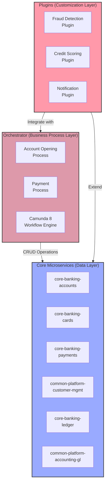
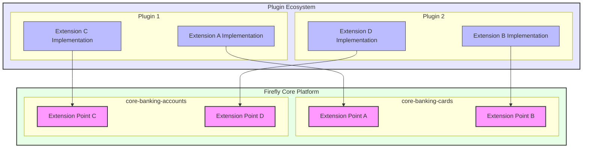
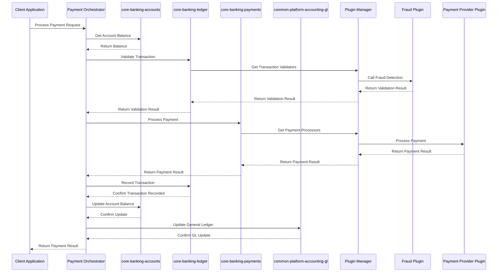
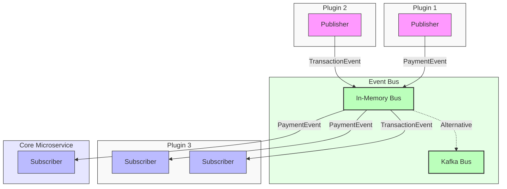
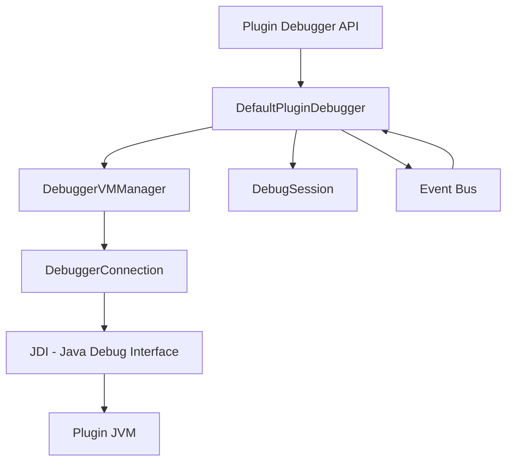

# Firefly Plugin Manager

A modular plugin system for extending Firefly Core Banking Platform functionality.

## Table of Contents

- [Overview](#overview)
- [Core Concepts](#core-concepts)
  - [Plugin](#plugin)
  - [Extension Point](#extension-point)
  - [Extension](#extension)
  - [Plugin Lifecycle](#plugin-lifecycle)
- [Architecture](#architecture)
  - [Plugin Registry](#plugin-registry)
  - [Extension Registry](#extension-registry)
  - [Event Bus](#event-bus)
  - [Plugin Loader](#plugin-loader)
- [Extension Points in Microservices](#extension-points-in-microservices)
  - [Defining Extension Points](#defining-extension-points)
  - [Microservice-Plugin Relationship](#microservice-plugin-relationship)
  - [Extension Point Design Principles](#extension-point-design-principles)
  - [Deciding What Logic Belongs Where](#deciding-what-logic-belongs-where)
- [Getting Started](#getting-started)
  - [Prerequisites](#prerequisites)
  - [Installation](#installation)
  - [Basic Usage](#basic-usage)
    - [Plugin Installation Methods](#plugin-installation-methods)
    - [Auto-detection with Annotation-based Plugins](#auto-detection-with-annotation-based-plugins)
- [Developing Plugins](#developing-plugins)
  - [Understanding the Plugin Contract](#understanding-the-plugin-contract)
  - [Step 1: Define an Extension Point](#step-1-define-an-extension-point)
  - [Step 2: Create a Plugin with Extensions](#step-2-create-a-plugin-with-extensions)
  - [Step 3: Plugin Configuration](#step-3-plugin-configuration)
    - [Updating Plugin Configuration](#updating-plugin-configuration)
    - [Configuration Sources](#configuration-sources)
  - [Step 4: Event-Based Communication](#step-4-event-based-communication)
  - [Step 5: Package the Plugin](#step-5-package-the-plugin)
- [Configuration](#configuration)
  - [Event Bus Configuration](#event-bus-configuration)
    - [Choosing an Event Bus Implementation](#choosing-an-event-bus-implementation)
    - [In-Memory Event Bus (Default)](#in-memory-event-bus-default)
    - [Kafka Event Bus (Optional)](#kafka-event-bus-optional)
    - [Event Serialization for Kafka](#event-serialization-for-kafka)
    - [Custom Serialization](#custom-serialization)
    - [Event Bus Architecture](#event-bus-architecture)
    - [Event Bus Best Practices](#event-bus-best-practices)
    - [Switching Between Event Bus Implementations](#switching-between-event-bus-implementations)
    - [Monitoring and Troubleshooting](#monitoring-and-troubleshooting)
- [Security Considerations](#security-considerations)
  - [Class Loading Isolation](#class-loading-isolation)
  - [Permission System](#permission-system)
  - [Signature Verification](#signature-verification)
  - [Resource Limiting](#resource-limiting)
  - [Sandboxing](#sandboxing)
  - [Security Best Practices](#security-best-practices)
- [Advanced Topics](#advanced-topics)
  - [Plugin Dependency Management](#plugin-dependency-management)
  - [Hot Deployment](#hot-deployment)
  - [Plugin Versioning and Compatibility](#plugin-versioning-and-compatibility)
  - [Plugin Health Monitoring](#plugin-health-monitoring)
  - [Plugin Debugging](#plugin-debugging)
  - [Plugin Testing Framework](#plugin-testing-framework)
- [Examples](#examples)
  - [Example 1: Credit Card Payment Plugin](#example-1-credit-card-payment-plugin)
  - [Example 2: Machine Learning Fraud Detection](#example-2-machine-learning-fraud-detection)
  - [Example 3: Company Information Enrichment](#example-3-company-information-enrichment)
- [Implementation Status](#implementation-status)
  - [Implemented Features](#implemented-features)
  - [Planned Features](#planned-features)
- [Complete Example: Microservice Extension Point and Plugin Implementation](#complete-example-microservice-extension-point-and-plugin-implementation)

## Overview

The Firefly Plugin Manager provides a standardized way to develop and manage plugins to extend core functionality of the Firefly Platform. It is built on Spring Boot 3.2.2, WebFlux, and Java 21, using reactive programming principles. This framework enables financial institutions to extend and customize the Firefly platform without modifying the core codebase, ensuring stability, security, and maintainability.

## Core Concepts

### Plugin

A plugin is a self-contained module that encapsulates specific functionality and can be dynamically loaded, started, stopped, and unloaded at runtime without requiring a system restart. Each plugin:

- Has a unique identity and metadata (ID, name, version, description, author)
- Follows a well-defined lifecycle (installed → initialized → started → stopped → uninstalled)
- Can depend on other plugins, creating a dependency graph
- Can provide one or more extensions to extend the core system's functionality
- Has its own configuration that can be modified at runtime
- Can be isolated from other plugins to prevent interference

Plugins are the primary unit of modularity in the system, allowing for a clean separation of concerns and enabling third-party developers to extend the platform without access to the core codebase.

### Extension Point

An extension point is a contract (typically an interface) that is defined within a core microservice and specifies how that microservice can be extended. Extension points:

- Are defined in core microservices (like core-banking-cards, core-banking-accounts)
- Define a clear API that extensions must implement
- Are identified by a unique ID
- Can specify whether they allow single or multiple implementations
- Provide metadata about their purpose and requirements
- Can be discovered dynamically at runtime

Extension points are the foundation of the plugin system's flexibility, as they define the "slots" where plugins can "plug in" their functionality. They represent the stable API that both the core microservices and plugins can rely on. By defining extension points within the core microservices, the system ensures that extensions are properly integrated with the core functionality while maintaining separation of concerns.

### Extension

An extension is a concrete implementation of an extension point provided by a plugin. Extensions:

- Implement the contract defined by an extension point in a core microservice
- Are associated with a specific plugin
- Can have a priority to determine their order when multiple extensions exist
- Can be discovered and used dynamically at runtime by core microservices
- Can be enabled or disabled independently of their plugin

Extensions are how plugins actually contribute functionality to the core microservices. They represent the "plugs" that fit into the "slots" defined by extension points. When a core microservice needs to use extended functionality, it queries the Plugin Manager for all available implementations of a specific extension point, and then uses those implementations to enhance its capabilities.

### Plugin Lifecycle

Plugins follow a well-defined lifecycle that allows the system to manage them properly:

1. **INSTALLED**: The plugin has been loaded into the system but not yet initialized. Its classes are available, but it's not ready for use.

2. **INITIALIZED**: The plugin has been initialized and its resources have been allocated, but it's not actively providing functionality yet. This state allows for setup tasks that need to happen before the plugin starts.

3. **STARTED**: The plugin is active and its extensions are available for use. It may be running background tasks or providing services.

4. **STOPPED**: The plugin has been temporarily deactivated. Its extensions are no longer available, but it remains initialized and can be quickly restarted.

5. **FAILED**: The plugin encountered an error during initialization, starting, or operation. This state indicates that intervention is needed.

6. **UNINSTALLED**: The plugin has been completely removed from the system. Its classes are unloaded and its resources are released.

Each state transition triggers events that other components can observe and react to, enabling coordinated behavior across the system.

## Architecture

The plugin manager consists of the following main components:

### Plugin Registry

The Plugin Registry is the central repository for all plugins in the system. It:

- Maintains a registry of all installed plugins and their metadata
- Tracks the current state of each plugin (installed, initialized, started, stopped, failed, uninstalled)
- Manages plugin lifecycle transitions (initialization, starting, stopping, uninstallation)
- Resolves plugin dependencies to ensure proper loading order
- Provides APIs to query plugins by ID, state, capability, or other criteria
- Publishes events when plugin states change
- Manages plugin configuration storage and updates

The Plugin Registry is the authoritative source of information about plugins in the system and the primary means of controlling their lifecycle.

### Extension Registry

The Extension Registry manages the relationship between extension points and their implementations. It:

- Maintains a registry of all extension points defined in the system
- Tracks all extensions that implement each extension point
- Manages extension priorities to determine their order
- Provides APIs to query extensions by extension point, plugin, or other criteria
- Handles dynamic registration and unregistration of extensions as plugins are started and stopped
- Supports filtering extensions based on capabilities or other criteria

The Extension Registry is the mechanism that enables the dynamic discovery and use of functionality provided by plugins.

### Event Bus

The Event Bus provides a decoupled communication mechanism between plugins and the core system. It:

- Implements a publish-subscribe pattern using reactive streams (Flux/Mono)
- Allows plugins to publish events without knowing who will consume them
- Enables plugins to subscribe to events without knowing who publishes them
- Supports filtering events by type, source, or content
- Provides both synchronous and asynchronous event handling
- Ensures that event subscribers don't block publishers
- Maintains a history of recent events for late subscribers
- Supports both in-memory and distributed (Kafka) transport mechanisms
- Enables cross-instance communication in clustered environments

The Event Bus is essential for loose coupling between components, enabling a truly modular system where plugins can interact without direct dependencies. The system supports two transport mechanisms:

#### In-Memory Event Bus

The default in-memory implementation provides high-performance event processing within a single JVM instance. It's ideal for standalone deployments and testing environments.

#### Kafka Event Bus (Optional)

The Kafka-based implementation is optional and requires additional dependencies. When enabled, it provides distributed event processing across multiple instances of the application with these benefits:

- Reliable event delivery with persistence
- Horizontal scalability for high-volume event processing
- Cross-instance communication in clustered environments
- Event replay capabilities for recovery scenarios
- Topic-based routing for efficient event distribution

The transport mechanism can be configured through application properties, allowing for easy switching between in-memory and Kafka modes based on deployment requirements.

### Plugin Loader

The Plugin Loader is responsible for loading plugin code into the system. It:

- Loads plugin classes from JAR files or other sources
- Creates isolated class loaders for each plugin to prevent interference
- Validates plugin metadata and dependencies before loading
- Performs security checks on plugin code
- Manages the plugin class loading hierarchy
- Handles plugin unloading and class garbage collection

The Plugin Loader is critical for the dynamic nature of the plugin system and for maintaining security boundaries between plugins.

## Extension Points in Microservices

A key architectural principle of the Firefly Plugin Manager is that extension points are defined within core microservices, while plugins implement these extension points. This section explains this critical relationship and how it enables a flexible, maintainable system.

The Firefly Platform follows a three-tier architecture:

1. **Core Microservices**: Focus on data management (CRUD operations), basic data validation, and defining extension points
2. **Orchestrator**: Implements complex business processes and workflows using Camunda 8, coordinates between multiple services
3. **Plugins**: Provide customizable implementations of extension points, integrate with external systems



This three-tier separation of responsibilities provides several benefits:

- **Stability**: Core microservices can evolve independently of business processes and custom extensions
- **Flexibility**: Business processes can be modified in the orchestrator without changing core data services
- **Extensibility**: New features can be added through plugins without modifying existing code

### Defining Extension Points

Extension points are contracts (interfaces) that are defined within Firefly core microservices. Each microservice identifies specific areas where its functionality can be extended or customized, and defines extension points for these areas.

**Key characteristics of extension points in microservices:**

- Extension points are defined in core microservices (e.g., core-banking-cards, core-banking-accounts)
- They represent stable contracts that plugins must implement
- They are designed to evolve slowly and maintain backward compatibility
- They are typically defined as Java interfaces with clear documentation
- They are annotated with `@ExtensionPoint` to provide metadata

**Example of an extension point defined in a core microservice:**

```java
// Defined in the core-banking-cards microservice
@ExtensionPoint(
        id = "com.catalis.banking.cards.fraud-detector",
        description = "Extension point for card transaction fraud detection",
        allowMultiple = true
)
public interface FraudDetector {
    /**
     * Analyzes a card transaction for potential fraud.
     *
     * @param transaction the transaction details
     * @return a Mono that emits a fraud analysis result
     */
    Mono<FraudAnalysisResult> analyzeTransaction(CardTransaction transaction);

    /**
     * Gets the name of this fraud detection method.
     *
     * @return the method name
     */
    String getDetectionMethodName();

    /**
     * Gets the confidence level of this detector.
     *
     * @return confidence level between 0.0 and 1.0
     */
    double getConfidenceLevel();
}
```

### Microservice-Plugin Relationship

The relationship between core microservices, the orchestrator, and plugins is fundamental to the Firefly architecture:

1. **Core Microservices Define Extension Points and Handle Data**: Core microservices focus on data management (CRUD operations) and define extension points that represent specific capabilities that can be extended. They typically don't contain complex business logic or orchestration between domains.

2. **Orchestrator Implements Business Processes**: The Orchestrator, built with Camunda 8 and Spring Boot 3 WebFlux, contains the complex business logic and workflows. It coordinates calls between different core microservices and manages long-running business processes.

3. **Plugins Implement Extension Points**: Plugins provide concrete implementations of extension points, extending the functionality of core microservices without modifying their code. They also integrate with external systems and add institution-specific features.

4. **Plugin Manager Connects Them**: The Plugin Manager acts as the bridge between microservices and plugins, allowing microservices to discover and use plugin implementations at runtime.

5. **Loose Coupling**: This architecture ensures loose coupling between core functionality, business processes, and extensions, allowing each to evolve independently.

#### Responsibilities by Component

| Component | Responsibilities | Examples |
|-----------|-----------------|----------|
| **Core Microservices** | • Basic data operations (CRUD)<br>• Data validation<br>• Define extension points<br>• Expose data APIs | • Account data in core-banking-accounts<br>• Transaction data in core-banking-ledger<br>• General Ledger in common-platform-accounting-gl<br>• Customer data in common-platform-customer-mgmt |
| **Orchestrator** | • Business process workflows<br>• Cross-domain validation<br>• Service orchestration<br>• Error handling & compensation | • Account opening process<br>• Payment processing workflow<br>• Loan application process |
| **Plugins** | • Implement extension points<br>• Integrate with external systems<br>• Add custom business logic<br>• Provide institution-specific features | • Fraud detection<br>• Credit scoring<br>• Notification services<br>• Regulatory reporting |

**Diagram: Microservice-Plugin Relationship**



The diagram illustrates how:
- Core microservices (like core-banking-cards and core-banking-accounts) define extension points
- Plugins provide implementations of these extension points
- The Plugin Manager (not shown) connects the extension points with their implementations
- This architecture allows for extending functionality without modifying core code

### Extension Point Design Principles

When designing extension points in core microservices, follow these principles:

1. **Stability**: Extension points should be stable contracts that change infrequently, as they form the foundation of the plugin ecosystem.

2. **Specificity**: Define extension points for specific, well-defined capabilities rather than general-purpose hooks.

3. **Versioning**: Design extension points with versioning in mind, allowing for evolution while maintaining backward compatibility.

4. **Documentation**: Thoroughly document the contract, including expected behavior, threading model, and error handling.

5. **Granularity**: Choose the right level of granularity—too fine-grained leads to complexity, too coarse-grained limits flexibility.

6. **Independence**: Extension points should be independent of specific implementation details.

7. **Reactive Design**: Design extension points to work well with reactive programming patterns, using Mono/Flux return types for asynchronous operations.

8. **Error Handling**: Define clear error handling expectations and recovery mechanisms.

9. **Security Boundaries**: Consider security implications and define appropriate permission requirements.

10. **Performance Considerations**: Document performance expectations and constraints for implementations.

### Deciding What Logic Belongs Where

When developing for the Firefly Platform, use these guidelines to determine where functionality should be implemented:



#### Core Microservices Should Contain

- Basic data operations (CRUD)
- Data model definitions and relationships
- Simple data validation rules
- Extension point interfaces
- Basic data retrieval and storage APIs

Specific responsibilities include:
- `core-banking-accounts`: Account data and balances
- `core-banking-ledger`: Transaction data and records
- `common-platform-accounting-gl`: Bank General Ledger
- `common-platform-customer-mgmt`: Customer information

#### Orchestrator Should Contain

- Complex business processes and workflows
- Coordination between multiple microservices
- Cross-domain business rules
- Error handling and compensation logic
- Integration with Camunda 8 for process management

#### Plugins Should Contain

- Implementations of extension points
- Integration with external systems
- Custom business logic specific to an institution
- Specialized algorithms (fraud detection, credit scoring, etc.)
- Value-added features that extend core functionality

For more detailed guidance, refer to the [Microservice vs Plugin Responsibilities](examples/04-microservice-plugin-responsibilities.md) document.

## Getting Started

### Prerequisites

- Java 21 or higher
- Maven 3.6 or higher

### Installation

Add the following dependency to your pom.xml:

```xml
<dependency>
    <groupId>com.catalis</groupId>
    <artifactId>lib-plugin-manager-core</artifactId>
    <version>1.0.0-SNAPSHOT</version>
</dependency>
```

### Basic Usage

1. **Initialize the Plugin Manager**

```java
@Autowired
private PluginManager pluginManager;

// Initialize the plugin manager
pluginManager.initialize().block();
```

2. **Register an Extension Point**

```java
// Register an extension point
pluginManager.getExtensionRegistry()
        .registerExtensionPoint("com.example.extension-point", MyExtensionPoint.class)
        .block();
```

3. **Install a Plugin**

#### Plugin Installation Methods

The Firefly Plugin Manager supports multiple methods for installing plugins, giving you flexibility in how you deploy and manage your plugin ecosystem:

```java
// Method 1: Install a plugin from a JAR file (traditional method)
// This loads a plugin from a JAR file in the filesystem
PluginDescriptor descriptor = pluginManager.installPlugin(Path.of("plugins/my-plugin.jar")).block();

// Method 2: Install a plugin from a Git repository
// This clones the repository and builds the plugin from source
URI repositoryUri = URI.create("https://github.com/example/my-plugin.git");
PluginDescriptor gitDescriptor = pluginManager.installPluginFromGit(repositoryUri).block();

// Method 3: Install a plugin from a Git repository with a specific branch
// This allows you to target a specific branch, tag, or commit
PluginDescriptor branchDescriptor = pluginManager.installPluginFromGit(
        URI.create("https://github.com/example/my-plugin.git"), "develop").block();

// Method 4: Auto-detect and install plugins from the classpath
// This automatically discovers all plugins in the application's classpath
// Useful when plugins are included as direct dependencies
Flux<PluginDescriptor> descriptors = pluginManager.installPluginsFromClasspath().collectList().block();

// Method 5: Auto-detect and install plugins from a specific package
// This limits auto-detection to a specific package namespace
Flux<PluginDescriptor> packageDescriptors = pluginManager.installPluginsFromClasspath("com.example.plugins").collectList().block();

```

#### Auto-detection with Annotation-based Plugins

For a more seamless integration, you can use annotation-based auto-detection:

```java
// 1. Add plugins as dependencies in your pom.xml
// <dependency>
//     <groupId>com.example</groupId>
//     <artifactId>payment-plugins</artifactId>
//     <version>1.0.0</version>
// </dependency>

// 2. Configure auto-detection in application.properties
// firefly.plugin-manager.scan-on-startup=true
// firefly.plugin-manager.auto-start-plugins=true

// 3. The Plugin Manager will automatically discover and start all plugins
// that have the @Plugin annotation and are in the classpath
```

Choose the installation method that best fits your deployment strategy. For more details on packaging and deploying plugins, see the [Step 5: Package the Plugin](#step-5-package-the-plugin) section.

4. **Start a Plugin**

```java
// Start a plugin
pluginManager.startPlugin("com.example.my-plugin").block();
```

5. **Get Extensions**

```java
// Get all extensions for an extension point
Flux<MyExtensionPoint> extensions = pluginManager.getExtensionRegistry()
        .getExtensions("com.example.extension-point");

// Get the highest priority extension
MyExtensionPoint extension = pluginManager.getExtensionRegistry()
        .getHighestPriorityExtension("com.example.extension-point")
        .block();
```

## Developing Plugins

Developing plugins for the Firefly Plugin Manager involves understanding several key concepts and following a structured approach. This section provides a comprehensive guide to creating effective plugins.

### Understanding the Plugin Contract

At its core, a plugin must implement the `Plugin` interface, which defines the fundamental lifecycle methods:

```java
public interface Plugin {
    // Returns metadata about the plugin
    PluginMetadata getMetadata();

    // Called when the plugin is first loaded
    Mono<Void> initialize();

    // Called when the plugin is started
    Mono<Void> start();

    // Called when the plugin is stopped
    Mono<Void> stop();

    // Called when the plugin is being uninstalled
    Mono<Void> uninstall();
}
```

These methods define the plugin's lifecycle and are called by the Plugin Manager at appropriate times. Each method returns a `Mono<Void>` to support reactive programming patterns, allowing for asynchronous operations during lifecycle transitions.

For convenience, the framework provides an `AbstractPlugin` base class that implements common functionality:

```java
public abstract class AbstractPlugin implements Plugin {
    private final PluginMetadata metadata;

    protected AbstractPlugin(PluginMetadata metadata) {
        this.metadata = metadata;
    }

    @Override
    public PluginMetadata getMetadata() {
        return metadata;
    }

    // Default implementations of lifecycle methods
    // ...
}
```

### Step 1: Define an Extension Point

Extension points are the foundation of the plugin system. They define the contract that plugins must implement to extend specific functionality. An extension point is typically an interface annotated with `@ExtensionPoint`:

```java
@ExtensionPoint(
        id = "com.catalis.banking.payment-processor",
        description = "Extension point for payment processing services",
        allowMultiple = true
)
public interface PaymentProcessor {
    /**
     * Gets the name of this payment method.
     *
     * @return the payment method name
     */
    String getPaymentMethodName();

    /**
     * Processes a payment transaction.
     *
     * @param amount the payment amount
     * @param currency the payment currency code (ISO 4217)
     * @param reference a unique reference for this transaction
     * @return a Mono that emits the transaction ID when complete
     */
    Mono<String> processPayment(BigDecimal amount, String currency, String reference);

    /**
     * Checks if this processor supports a specific currency.
     *
     * @param currency the currency code to check (ISO 4217)
     * @return true if supported, false otherwise
     */
    boolean supportsCurrency(String currency);

    /**
     * Gets the fee structure for this payment method.
     *
     * @return the fee structure
     */
    FeeStructure getFeeStructure();
}
```

When designing extension points, consider the following best practices:

- **Stability**: Extension points should be stable contracts that change infrequently
- **Cohesion**: Each extension point should have a single, well-defined responsibility
- **Granularity**: Extension points should be fine-grained enough to allow for flexible implementation but not so fine-grained that they become cumbersome
- **Documentation**: Thoroughly document the contract, including expected behavior, threading model, and error handling
- **Versioning**: Consider how the extension point will evolve over time and how backward compatibility will be maintained

The `@ExtensionPoint` annotation provides metadata about the extension point:

- **id**: A unique identifier for the extension point (use reverse-domain naming convention)
- **description**: A human-readable description of the extension point's purpose
- **allowMultiple**: Whether multiple implementations of this extension point can be active simultaneously

### Step 2: Create a Plugin with Extensions

A plugin is a concrete implementation that can provide one or more extensions. Here's a comprehensive example:

```java
@Plugin(
        id = "com.catalis.banking.credit-card-payment",
        name = "Credit Card Payment Processor",
        version = "1.0.0",
        description = "Processes credit card payments with support for major card networks",
        author = "Catalis Financial Services",
        minPlatformVersion = "1.0.0",
        dependencies = {"com.catalis.banking.core-services"}
)
public class CreditCardPaymentPlugin extends AbstractPlugin {

    private static final Logger logger = LoggerFactory.getLogger(CreditCardPaymentPlugin.class);

    private final CreditCardPaymentProcessor paymentProcessor;
    private final PluginEventBus eventBus;
    private final PaymentGatewayClient gatewayClient;
    private Disposable eventSubscription;

    /**
     * Creates a new CreditCardPaymentPlugin.
     *
     * @param eventBus the event bus for inter-plugin communication
     */
    public CreditCardPaymentPlugin(PluginEventBus eventBus) {
        super(PluginMetadata.builder()
                .id("com.catalis.banking.credit-card-payment")
                .name("Credit Card Payment Processor")
                .version("1.0.0")
                .description("Processes credit card payments with support for major card networks")
                .author("Catalis Financial Services")
                .minPlatformVersion("1.0.0")
                .dependencies(Set.of("com.catalis.banking.core-services"))
                .build());

        this.eventBus = eventBus;
        this.gatewayClient = new PaymentGatewayClient();
        this.paymentProcessor = new CreditCardPaymentProcessor();
    }

    @Override
    public Mono<Void> initialize() {
        logger.info("Initializing Credit Card Payment Plugin");

        // Initialize the payment gateway client
        return gatewayClient.initialize()
                .doOnSuccess(v -> logger.info("Payment gateway client initialized successfully"))
                .doOnError(e -> logger.error("Failed to initialize payment gateway client", e));
    }

    @Override
    public Mono<Void> start() {
        logger.info("Starting Credit Card Payment Plugin");

        // Subscribe to relevant events
        eventSubscription = eventBus.subscribe(PaymentRequestEvent.class)
                .filter(event -> event.getPaymentMethod().equals("CREDIT_CARD"))
                .flatMap(event -> paymentProcessor.processPayment(
                        event.getAmount(),
                        event.getCurrency(),
                        event.getReference())
                        .map(transactionId -> new PaymentCompletedEvent(
                                getMetadata().id(),
                                event.getReference(),
                                transactionId,
                                event.getAmount(),
                                event.getCurrency()))
                        .flatMap(eventBus::publish)
                        .onErrorResume(error -> {
                            logger.error("Payment processing error", error);
                            return eventBus.publish(new PaymentFailedEvent(
                                    getMetadata().id(),
                                    event.getReference(),
                                    error.getMessage()));
                        }))
                .subscribe();

        // Connect to the payment gateway
        return gatewayClient.connect()
                .doOnSuccess(v -> logger.info("Connected to payment gateway"))
                .doOnError(e -> logger.error("Failed to connect to payment gateway", e));
    }

    @Override
    public Mono<Void> stop() {
        logger.info("Stopping Credit Card Payment Plugin");

        // Dispose of event subscriptions
        if (eventSubscription != null && !eventSubscription.isDisposed()) {
            eventSubscription.dispose();
        }

        // Disconnect from the payment gateway
        return gatewayClient.disconnect()
                .doOnSuccess(v -> logger.info("Disconnected from payment gateway"))
                .doOnError(e -> logger.error("Error disconnecting from payment gateway", e));
    }

    @Override
    public Mono<Void> uninstall() {
        logger.info("Uninstalling Credit Card Payment Plugin");

        // Clean up any persistent resources
        return Mono.fromRunnable(() -> {
            // Remove any stored data, close connections, etc.
        });
    }

    /**
     * Gets the payment processor extension.
     *
     * @return the payment processor
     */
    public PaymentProcessor getPaymentProcessor() {
        return paymentProcessor;
    }

    /**
     * Implementation of the PaymentProcessor extension point.
     */
    @Extension(
            extensionPointId = "com.catalis.banking.payment-processor",
            priority = 100,
            description = "Credit card payment processor supporting Visa, Mastercard, and Amex"
    )
    public class CreditCardPaymentProcessor implements PaymentProcessor {

        @Override
        public String getPaymentMethodName() {
            return "Credit Card";
        }

        @Override
        public Mono<String> processPayment(BigDecimal amount, String currency, String reference) {
            logger.info("Processing credit card payment: amount={}, currency={}, reference={}",
                    amount, currency, reference);

            // Validate inputs
            if (amount.compareTo(BigDecimal.ZERO) <= 0) {
                return Mono.error(new IllegalArgumentException("Payment amount must be positive"));
            }

            if (!supportsCurrency(currency)) {
                return Mono.error(new UnsupportedOperationException("Currency not supported: " + currency));
            }

            // Process the payment through the gateway
            return gatewayClient.processPayment(amount, currency, reference)
                    .doOnSuccess(transactionId -> {
                        logger.info("Payment processed successfully: transactionId={}", transactionId);
                    })
                    .doOnError(error -> {
                        logger.error("Payment processing failed: {}", error.getMessage());
                    });
        }

        @Override
        public boolean supportsCurrency(String currency) {
            // Support major currencies
            return Set.of("USD", "EUR", "GBP", "JPY", "CAD", "AUD", "CHF").contains(currency);
        }

        @Override
        public FeeStructure getFeeStructure() {
            return new FeeStructure(
                    new BigDecimal("0.029"),  // 2.9% percentage fee
                    new BigDecimal("0.30"),   // $0.30 fixed fee
                    "USD"                     // Fee currency
            );
        }
    }

    /**
     * Mock payment gateway client for demonstration purposes.
     */
    private static class PaymentGatewayClient {

        Mono<Void> initialize() {
            // Simulate initialization
            return Mono.delay(Duration.ofMillis(500)).then();
        }

        Mono<Void> connect() {
            // Simulate connection establishment
            return Mono.delay(Duration.ofMillis(300)).then();
        }

        Mono<Void> disconnect() {
            // Simulate disconnection
            return Mono.delay(Duration.ofMillis(200)).then();
        }

        Mono<String> processPayment(BigDecimal amount, String currency, String reference) {
            // Simulate payment processing with the gateway
            return Mono.delay(Duration.ofMillis(1000))
                    .map(ignored -> UUID.randomUUID().toString());
        }
    }
}
```

When implementing a plugin, consider these best practices:

- **Lifecycle Management**: Properly implement all lifecycle methods, ensuring resources are acquired in `initialize`/`start` and released in `stop`/`uninstall`
- **Error Handling**: Use reactive error handling patterns to gracefully handle failures
- **Resource Management**: Dispose of subscriptions and close connections when the plugin is stopped
- **Thread Safety**: Ensure your plugin is thread-safe, as it may be called from multiple threads
- **Configuration**: Design your plugin to be configurable without requiring code changes
- **Logging**: Use appropriate logging levels and include contextual information
- **Event-Based Communication**: Use the event bus for communication rather than direct method calls

The `@Plugin` annotation provides metadata about the plugin:

- **id**: A unique identifier for the plugin (use reverse-domain naming convention)
- **name**: A human-readable name for the plugin
- **version**: The plugin version (using semantic versioning)
- **description**: A description of the plugin's functionality
- **author**: The author or organization that created the plugin
- **minPlatformVersion**: The minimum required version of the platform
- **maxPlatformVersion**: The maximum compatible version of the platform (optional)
- **dependencies**: IDs of other plugins that this plugin depends on

The `@Extension` annotation marks a class as an implementation of an extension point:

- **extensionPointId**: The ID of the extension point being implemented
- **priority**: The priority of this implementation (higher values indicate higher priority)
- **description**: A description of this specific implementation

### Step 3: Plugin Configuration

Plugins often need configuration that can be modified without changing code. The Firefly Plugin Manager provides a configuration system that allows plugins to access and update their configuration:

```java
// Access configuration in your plugin
@Override
public Mono<Void> initialize() {
    return Mono.fromRunnable(() -> {
        // Get configuration from the plugin manager
        Map<String, Object> config = pluginManager.getPlugin(getMetadata().id())
                .block()
                .configuration();

        // Parse configuration
        String apiKey = (String) config.getOrDefault("apiKey", "");
        String merchantId = (String) config.getOrDefault("merchantId", "");
        int timeoutSeconds = (int) config.getOrDefault("timeoutSeconds", 30);

        // Initialize with configuration
        gatewayClient.initialize(apiKey, merchantId, timeoutSeconds);

        // Subscribe to configuration changes
        eventBus.subscribe(PluginConfigurationEvent.class)
                .filter(event -> event.getPluginId().equals(getMetadata().id()))
                .subscribe(event -> {
                    Map<String, Object> newConfig = event.getNewConfiguration();
                    // Update client with new configuration
                    String newApiKey = (String) newConfig.getOrDefault("apiKey", apiKey);
                    String newMerchantId = (String) newConfig.getOrDefault("merchantId", merchantId);
                    int newTimeoutSeconds = (int) newConfig.getOrDefault("timeoutSeconds", timeoutSeconds);

                    gatewayClient.updateConfiguration(newApiKey, newMerchantId, newTimeoutSeconds);
                });
    });
}
```

#### Updating Plugin Configuration

The Plugin Manager provides APIs to update plugin configuration at runtime:

```java
// Get the current plugin configuration
PluginDescriptor descriptor = pluginManager.getPlugin("com.example.payment-plugin").block();
Map<String, Object> currentConfig = descriptor.configuration();

// Create a new configuration with updated values
Map<String, Object> newConfig = new HashMap<>(currentConfig);
newConfig.put("apiKey", "new-api-key-value");
newConfig.put("timeoutSeconds", 60);

// Update the plugin configuration
pluginManager.updatePluginConfiguration("com.example.payment-plugin", newConfig)
    .doOnSuccess(v -> log.info("Plugin configuration updated successfully"))
    .doOnError(e -> log.error("Failed to update plugin configuration", e))
    .subscribe();
```

#### Configuration Sources

Plugin configuration can come from multiple sources:

1. **Default Values**: Defined in the plugin code
2. **Application Properties**: Defined in `application.properties` or `application.yml`
3. **External Configuration**: Loaded from external sources (database, config server)
4. **Runtime Updates**: Applied through the Plugin Manager API

Example of configuration in application properties:

```properties
# Plugin-specific configuration
firefly.plugin-manager.plugins.com\.example\.payment-plugin.apiKey=production-key-12345
firefly.plugin-manager.plugins.com\.example\.payment-plugin.merchantId=MERCHANT_XYZ
firefly.plugin-manager.plugins.com\.example\.payment-plugin.timeoutSeconds=45
```

Configuration best practices:

- **Default Values**: Always provide sensible default values for configuration properties
- **Validation**: Validate configuration values to ensure they are within acceptable ranges
- **Dynamic Updates**: Design your plugin to handle configuration changes at runtime
- **Documentation**: Document all configuration properties, their purpose, and acceptable values
- **Scoping**: Use namespaced configuration keys to avoid conflicts with other plugins
- **Security**: Avoid storing sensitive information (like API keys) in plain text; use encryption or secure vaults
- **Versioning**: Consider versioning your configuration schema to handle upgrades gracefully

### Step 4: Event-Based Communication

Plugins should communicate with each other and the core system through events rather than direct method calls. This promotes loose coupling and allows for more flexible system architecture:

```java
// Define an event
public class PaymentProcessedEvent extends PluginEvent {
    private final BigDecimal amount;
    private final String currency;
    private final String reference;
    private final String transactionId;

    public PaymentProcessedEvent(String pluginId, String reference, String transactionId,
                                BigDecimal amount, String currency) {
        super(pluginId, "PAYMENT_PROCESSED");
        this.reference = reference;
        this.transactionId = transactionId;
        this.amount = amount;
        this.currency = currency;
    }

    // Getters
    public String getReference() { return reference; }
    public String getTransactionId() { return transactionId; }
    public BigDecimal getAmount() { return amount; }
    public String getCurrency() { return currency; }
}

// Publish an event
eventBus.publish(new PaymentProcessedEvent(
        getMetadata().id(),
        reference,
        transactionId,
        amount,
        currency))
        .subscribe();

// Subscribe to events
eventBus.subscribe(PaymentProcessedEvent.class)
        .filter(event -> event.getCurrency().equals("USD"))
        .subscribe(event -> {
            logger.info("Payment processed: amount={}, currency={}, reference={}, transactionId={}",
                    event.getAmount(),
                    event.getCurrency(),
                    event.getReference(),
                    event.getTransactionId());
        });
```

Event-based communication best practices:

- **Event Design**: Design events to carry all necessary information but avoid excessive data
- **Event Types**: Create specific event types for different kinds of notifications
- **Filtering**: Use filtering to receive only relevant events
- **Error Handling**: Handle errors in event subscribers to prevent them from affecting publishers
- **Backpressure**: Be aware of backpressure in high-volume event scenarios
- **Subscription Management**: Dispose of subscriptions when they are no longer needed

### Step 5: Package the Plugin

To make your plugin available to the Firefly Plugin Manager, you need to package it as a JAR file with the appropriate metadata:

1. **Create a service provider configuration file**:

Create a file at `META-INF/services/com.catalis.core.plugin.api.Plugin` with the fully qualified name of your plugin class:

```
com.catalis.banking.CreditCardPaymentPlugin
```

This file enables the Java ServiceLoader mechanism to discover your plugin.

2. **Include dependencies**:

Include any dependencies that aren't provided by the core system. You can use Maven's shade plugin or similar tools to create a fat JAR with all dependencies.

3. **Build the JAR**:

Use Maven or Gradle to build your plugin JAR:

```xml
<!-- Maven pom.xml snippet -->
<build>
    <plugins>
        <plugin>
            <groupId>org.apache.maven.plugins</groupId>
            <artifactId>maven-jar-plugin</artifactId>
            <version>3.2.0</version>
            <configuration>
                <archive>
                    <manifestEntries>
                        <Plugin-Id>${plugin.id}</Plugin-Id>
                        <Plugin-Version>${project.version}</Plugin-Version>
                        <Plugin-Provider>${project.organization.name}</Plugin-Provider>
                    </manifestEntries>
                </archive>
            </configuration>
        </plugin>
    </plugins>
</build>
```

4. **Deploy the plugin**:

There are multiple ways to deploy and install plugins:

**a. JAR File (Traditional Method)**

Place the JAR file in the plugins directory of the Firefly platform, or use the Plugin Manager API to install it programmatically:

```java
PluginDescriptor descriptor = pluginManager.installPlugin(Path.of("plugins/credit-card-payment-1.0.0.jar")).block();
pluginManager.startPlugin(descriptor.metadata().id()).block();
```

**b. Git Repository**

Deploy your plugin to a Git repository and install it directly from there:

```java
URI repositoryUri = URI.create("https://github.com/firefly-oss/credit-card-payment-plugin.git");
PluginDescriptor descriptor = pluginManager.installPluginFromGit(repositoryUri).block();
pluginManager.startPlugin(descriptor.metadata().id()).block();
```

**c. Classpath Auto-detection**

Include your plugin in the application's classpath and let the plugin manager auto-detect it:

```java
// Auto-detect and install all plugins in the classpath
Flux<PluginDescriptor> descriptors = pluginManager.installPluginsFromClasspath().collectList().block();

// Start all discovered plugins
descriptors.forEach(descriptor -> {
    pluginManager.startPlugin(descriptor.metadata().id()).block();
});
```

Packaging best practices:

- **Minimize Size**: Include only necessary dependencies to keep the plugin size manageable
- **Versioning**: Use semantic versioning for your plugins
- **Documentation**: Include documentation in the JAR (e.g., README, Javadoc)
- **Manifest Attributes**: Add plugin metadata to the JAR manifest
- **Testing**: Test your plugin in isolation before deploying it
- **Signature**: Consider signing your plugin JAR for security
- **Git Repository Structure**: When using Git deployment, ensure your repository has a clear structure with a proper build file (pom.xml or build.gradle)
- **Annotation-based Configuration**: For classpath auto-detection, ensure your plugin class is properly annotated with @Plugin

## Configuration

The plugin manager can be configured using the following properties:

```properties
# Plugin Manager Configuration
firefly.plugin-manager.plugins-directory=plugins
firefly.plugin-manager.auto-start-plugins=true
firefly.plugin-manager.scan-on-startup=true

# Allowed packages for plugins
firefly.plugin-manager.allowed-packages=com.catalis.core.plugin.api,com.catalis.core.plugin.annotation

# Event Bus Configuration
# Use 'in-memory' or 'kafka'
firefly.plugin-manager.event-bus.type=in-memory
firefly.plugin-manager.event-bus.distributed-events=false

# Kafka Configuration (optional, only needed when using kafka event bus)
firefly.plugin-manager.event-bus.kafka.bootstrap-servers=localhost:9092
firefly.plugin-manager.event-bus.kafka.consumer-group-id=firefly-plugin-manager
firefly.plugin-manager.event-bus.kafka.default-topic=firefly-plugin-events
firefly.plugin-manager.event-bus.kafka.auto-create-topics=true
firefly.plugin-manager.event-bus.kafka.num-partitions=3
firefly.plugin-manager.event-bus.kafka.replication-factor=1
```

### Event Bus Configuration

The Event Bus can be configured to use either in-memory or Kafka transport. This section provides a comprehensive guide on configuring and using both event systems.

#### Choosing an Event Bus Implementation

The choice between in-memory and Kafka event bus depends on your deployment scenario:

- **In-Memory Event Bus**: Use for single-instance deployments, development environments, or when all plugins run within the same JVM.
- **Kafka Event Bus**: Use for distributed deployments, production environments with multiple instances, or when you need event persistence and replay capabilities.

#### In-Memory Event Bus (Default)

The in-memory event bus is suitable for standalone deployments and provides high-performance event processing within a single JVM instance.

**Configuration:**

```properties
# application.properties or application.yml
firefly.plugin-manager.event-bus.type=in-memory
```

**Usage Example:**

```java
@Autowired
private PluginEventBus eventBus;

// Publishing events
public Mono<Void> processPayment(PaymentRequest request) {
    return paymentService.process(request)
        .flatMap(result -> {
            // Create and publish an event
            PaymentProcessedEvent event = new PaymentProcessedEvent(
                "com.example.payment-plugin",
                request.getReference(),
                result.getTransactionId(),
                request.getAmount(),
                request.getCurrency()
            );
            return eventBus.publish(event);
        });
}

// Subscribing to events
@PostConstruct
public void initialize() {
    // Subscribe to specific event types
    Disposable subscription = eventBus.subscribe(PaymentProcessedEvent.class)
        .filter(event -> event.getAmount().compareTo(new BigDecimal("1000")) > 0)
        .subscribe(event -> {
            logger.info("Large payment processed: {}", event.getTransactionId());
            // Process the event
        });

    // Store the subscription for later disposal
    this.eventSubscription = subscription;
}

@PreDestroy
public void cleanup() {
    // Always dispose subscriptions when no longer needed
    if (eventSubscription != null && !eventSubscription.isDisposed()) {
        eventSubscription.dispose();
    }
}
```

#### Kafka Event Bus (Optional)

The Kafka event bus enables distributed event processing across multiple instances of the application. It provides reliable event delivery, persistence, and replay capabilities.

**Prerequisites:**

1. A running Kafka broker or cluster
2. Additional dependencies in your project

**Adding Kafka Dependencies:**

To use the Kafka event bus, add the following dependencies to your project:

```xml
<!-- Maven pom.xml -->
<dependency>
    <groupId>io.projectreactor.kafka</groupId>
    <artifactId>reactor-kafka</artifactId>
    <version>1.3.21</version>
</dependency>
<dependency>
    <groupId>org.apache.kafka</groupId>
    <artifactId>kafka-clients</artifactId>
    <version>3.6.1</version>
</dependency>
```

Or if using Gradle:

```groovy
// Gradle build.gradle
implementation 'io.projectreactor.kafka:reactor-kafka:1.3.21'
implementation 'org.apache.kafka:kafka-clients:3.6.1'
```

These dependencies are marked as optional in the plugin manager, so they won't be transitively included in your project.

**Configuration:**

```properties
# Basic configuration
firefly.plugin-manager.event-bus.type=kafka
firefly.plugin-manager.event-bus.distributed-events=true
firefly.plugin-manager.event-bus.kafka.bootstrap-servers=kafka1:9092,kafka2:9092,kafka3:9092
firefly.plugin-manager.event-bus.kafka.consumer-group-id=firefly-plugin-manager-prod

# Advanced configuration
firefly.plugin-manager.event-bus.kafka.default-topic=firefly-plugin-events
firefly.plugin-manager.event-bus.kafka.auto-create-topics=true
firefly.plugin-manager.event-bus.kafka.num-partitions=3
firefly.plugin-manager.event-bus.kafka.replication-factor=1
```

In a clustered environment, each instance should use the same consumer group ID to ensure proper event distribution.

**Usage Example:**

The usage pattern is identical to the in-memory event bus, as the implementation details are abstracted away:

```java
@Autowired
private PluginEventBus eventBus;

// Publishing events
public Mono<Void> notifyFraudDetection(Transaction transaction) {
    TransactionEvent event = new TransactionEvent(
        "com.example.transaction-plugin",
        transaction.getId(),
        transaction.getAmount(),
        transaction.getAccountId()
    );
    return eventBus.publish(event);
}

// Subscribing to events
@PostConstruct
public void initialize() {
    // The same code works with both in-memory and Kafka event bus
    this.eventSubscription = eventBus.subscribe(TransactionEvent.class)
        .filter(event -> event.getAmount().compareTo(new BigDecimal("10000")) > 0)
        .subscribe(event -> {
            logger.info("High-value transaction detected: {}", event.getTransactionId());
            fraudDetectionService.analyze(event);
        });
}
```

#### Event Serialization for Kafka

When using the Kafka event bus, events need to be serializable. The Firefly Plugin Manager handles serialization automatically, but you should follow these guidelines for your event classes:

```java
// Serialization-friendly event class
public class PaymentProcessedEvent extends PluginEvent implements Serializable {
    // Use primitive types or standard Java serializable classes
    private final BigDecimal amount;
    private final String currency;
    private final String reference;
    private final String transactionId;
    private final LocalDateTime timestamp;

    // Include a no-args constructor for deserialization
    protected PaymentProcessedEvent() {
        super("", "");
        this.amount = null;
        this.currency = null;
        this.reference = null;
        this.transactionId = null;
        this.timestamp = null;
    }

    public PaymentProcessedEvent(String pluginId, String reference, String transactionId,
                              BigDecimal amount, String currency) {
        super(pluginId, "PAYMENT_PROCESSED");
        this.reference = reference;
        this.transactionId = transactionId;
        this.amount = amount;
        this.currency = currency;
        this.timestamp = LocalDateTime.now();
    }

    // Getters
    public String getReference() { return reference; }
    public String getTransactionId() { return transactionId; }
    public BigDecimal getAmount() { return amount; }
    public String getCurrency() { return currency; }
    public LocalDateTime getTimestamp() { return timestamp; }
}
```

#### Custom Serialization

For complex events or better performance, you can provide custom serializers and deserializers:

```java
// application.properties
firefly.plugin-manager.event-bus.kafka.serializer=com.example.CustomEventSerializer
firefly.plugin-manager.event-bus.kafka.deserializer=com.example.CustomEventDeserializer

// Custom serializer implementation
public class CustomEventSerializer implements Serializer<PluginEvent> {
    private final ObjectMapper objectMapper = new ObjectMapper()
            .registerModule(new JavaTimeModule())
            .configure(SerializationFeature.WRITE_DATES_AS_TIMESTAMPS, false);

    @Override
    public byte[] serialize(String topic, PluginEvent event) {
        try {
            return objectMapper.writeValueAsBytes(event);
        } catch (Exception e) {
            throw new SerializationException("Error serializing event", e);
        }
    }
}
```

#### Event Bus Architecture

The Event Bus follows a publish-subscribe pattern that enables loose coupling between components. The following diagram illustrates the relationship between publishers, subscribers, and the event bus:



Key aspects of the event bus architecture:

1. **Publishers**: Components that generate events (plugins, core services)
2. **Event Bus**: Central message broker that routes events (in-memory or Kafka)
3. **Subscribers**: Components that consume events (plugins, core services)
4. **Events**: Typed messages that carry information between components
5. **Filtering**: Subscribers can filter events by type or content

#### Event Bus Best Practices

1. **Event Design:**
   - Create specific event classes for different types of notifications
   - Include all necessary information in the event, but avoid excessive data
   - Make events immutable to prevent modification during propagation
   - Use clear naming conventions for event classes (e.g., `PaymentProcessedEvent`, `UserRegisteredEvent`)

2. **Publishing Events:**
   - Always subscribe to the result of `eventBus.publish()` or use `.subscribe()` to ensure the event is actually sent
   - Include error handling for publish operations
   - Consider using `doOnError` and `doOnSuccess` operators for logging

3. **Subscribing to Events:**
   - Use type-based filtering with `eventBus.subscribe(EventType.class)`
   - Apply additional filtering with the `.filter()` operator
   - Store subscription references and dispose them when no longer needed
   - Handle errors within subscribers to prevent them from affecting other subscribers

4. **Performance Considerations:**
   - With Kafka, be mindful of serialization/deserialization overhead
   - For high-volume events, consider using backpressure strategies
   - Monitor Kafka consumer lag in production environments

5. **Testing:**
   - Use the in-memory event bus for unit and integration tests
   - Create test utilities to verify that events were published correctly

#### Switching Between Event Bus Implementations

The Firefly Plugin Manager allows you to switch between event bus implementations without code changes. Simply update the configuration properties and restart the application. This makes it easy to use the in-memory implementation during development and testing, and switch to Kafka for production deployments.

#### Monitoring and Troubleshooting

**For In-Memory Event Bus:**
- Use logging to track event publishing and subscription
- Monitor memory usage, as events are stored in memory

**For Kafka Event Bus:**
- Use Kafka monitoring tools to track topic metrics
- Monitor consumer lag to ensure events are being processed in a timely manner
- Check Kafka logs for connection issues or configuration problems
- Verify that the Kafka cluster is healthy and accessible

## Security Considerations

Plugin systems introduce potential security risks that must be carefully managed. The Firefly Plugin Manager implements several security mechanisms to protect the core system and ensure safe plugin operation.

### Class Loading Isolation

Each plugin runs in its own isolated class loader, which provides several security benefits:

- **Namespace Isolation**: Prevents plugins from accessing or modifying classes from other plugins
- **Dependency Isolation**: Allows plugins to use different versions of the same library without conflicts
- **Controlled Access**: Restricts which core system classes plugins can access
- **Unloading**: Enables complete unloading of plugin classes when they are no longer needed
- **Package Export/Import**: Allows controlled sharing of classes between plugins

The enhanced `PluginClassLoader` implements this isolation:

```java
public class PluginClassLoader extends URLClassLoader {
    private final Set<String> allowedPackages;
    private final String pluginId;
    private final Set<String> exportedPackages;
    private final ConcurrentHashMap<String, Class<?>> loadedPluginClasses;
    private final ProtectionDomain protectionDomain;

    public PluginClassLoader(String pluginId, URL[] urls, ClassLoader parent,
                            Collection<String> allowedPackages, ProtectionDomain protectionDomain) {
        super(urls, parent);
        this.pluginId = pluginId;
        this.allowedPackages = new HashSet<>();
        this.exportedPackages = new HashSet<>();
        this.loadedPluginClasses = new ConcurrentHashMap<>();
        this.protectionDomain = protectionDomain;

        // Add default allowed packages
        addDefaultAllowedPackages();

        // Add additional allowed packages
        if (allowedPackages != null) {
            this.allowedPackages.addAll(allowedPackages);
        }
    }

    @Override
    protected Class<?> loadClass(String name, boolean resolve) throws ClassNotFoundException {
        synchronized (getClassLoadingLock(name)) {
            // First, check if the class has already been loaded by this class loader
            Class<?> loadedClass = findLoadedClass(name);
            if (loadedClass != null) {
                if (resolve) {
                    resolveClass(loadedClass);
                }
                return loadedClass;
            }

            // Check if the class is from an allowed package
            boolean isAllowed = isPackageAllowed(name);

            if (isAllowed) {
                // Delegate to parent class loader for allowed packages
                try {
                    Class<?> parentClass = getParent().loadClass(name);
                    if (resolve) {
                        resolveClass(parentClass);
                    }
                    return parentClass;
                } catch (ClassNotFoundException e) {
                    // Fall through to try loading from plugin
                }
            }

            try {
                // Try to load the class from the plugin
                Class<?> pluginClass = findClass(name);
                if (resolve) {
                    resolveClass(pluginClass);
                }

                // Cache the loaded class
                loadedPluginClasses.put(name, pluginClass);

                return pluginClass;
            } catch (ClassNotFoundException e) {
                // If not allowed and not found in plugin, throw exception
                if (!isAllowed) {
                    logger.warn("Plugin {} attempted to access unauthorized class: {}", pluginId, name);
                    throw new SecurityException("Access to class " + name + " is not allowed for plugin " + pluginId);
                }

                // If allowed but not found anywhere, throw the original exception
                throw e;
            }
        }
    }
}
```

### Permission System

The plugin manager implements a fine-grained permission system that controls what operations plugins can perform. This is implemented through the `PluginSecurityManager` and `PluginPermission` classes:

- **File System Access**: Controls which directories plugins can read from or write to
- **Network Access**: Restricts which hosts and ports plugins can connect to
- **System Properties**: Controls which system properties plugins can read or modify
- **Reflection**: Limits reflective access to system classes
- **Thread Creation**: Controls whether and how plugins can create threads
- **Native Code**: Prevents plugins from loading native libraries unless explicitly allowed
- **Execute**: Controls execution of external commands

The `PluginPermission` class represents a permission that can be granted to a plugin:

```java
public class PluginPermission implements Serializable {
    public enum Type {
        FILE_SYSTEM,
        NETWORK,
        SYSTEM_PROPERTIES,
        REFLECTION,
        THREAD,
        NATIVE_CODE,
        EXECUTE
    }

    private final Type type;
    private final String target;
    private final String action;

    // Methods to check if one permission implies another
    public boolean implies(PluginPermission other) {
        if (other == null || !type.equals(other.type)) {
            return false;
        }

        // If this permission has no target, it implies any target
        if (target == null) {
            return true;
        }

        // If this permission has a target, it must match or be a prefix of the other target
        if (other.target == null || !other.target.startsWith(target)) {
            return false;
        }

        // If this permission has no action, it implies any action
        if (action == null) {
            return true;
        }

        // If this permission has an action, the other must have the same action
        return action.equals(other.action);
    }
}
```

Permissions can be configured at the system level and overridden for specific plugins:

```properties
# Global permission settings
firefly.plugin-manager.security.enforce-security-checks=true
firefly.plugin-manager.security.allow-file-access=false
firefly.plugin-manager.security.allow-network-access=true
firefly.plugin-manager.security.allowed-hosts=api.payment-gateway.com,auth.payment-gateway.com

# Plugin-specific permissions
firefly.plugin-manager.security.plugins.com\.catalis\.banking\.credit-card-payment.allow-file-access=true
firefly.plugin-manager.security.plugins.com\.catalis\.banking\.credit-card-payment.allowed-directories=/tmp/payments
```

### Signature Verification

Plugins can be signed with digital certificates to verify their authenticity and integrity. This is implemented through the `PluginSignatureVerifier` class:

- **JAR Signing**: Plugins are distributed as signed JAR files
- **Certificate Validation**: The plugin manager verifies the signature against trusted certificates
- **Integrity Checking**: Ensures the plugin code hasn't been tampered with
- **Trust Levels**: Different certificates can confer different levels of trust and permissions

The `PluginSignatureVerifier` class handles signature verification:

```java
public class PluginSignatureVerifier {
    private final Set<X509Certificate> trustedCertificates = new HashSet<>();
    private final boolean requireSignature;

    public PluginSignatureVerifier(boolean requireSignature) {
        this.requireSignature = requireSignature;
    }

    public void addTrustedCertificate(X509Certificate certificate) {
        trustedCertificates.add(certificate);
    }

    public void loadTrustedCertificate(Path certificatePath) throws CertificateException, IOException {
        try (InputStream is = Files.newInputStream(certificatePath)) {
            CertificateFactory cf = CertificateFactory.getInstance("X.509");
            X509Certificate cert = (X509Certificate) cf.generateCertificate(is);
            addTrustedCertificate(cert);
        }
    }

    public boolean verifyPluginSignature(Path pluginPath) throws SecurityException {
        try (JarFile jarFile = new JarFile(pluginPath.toFile(), true)) {
            // Get the manifest
            Manifest manifest = jarFile.getManifest();
            if (manifest == null) {
                if (requireSignature) {
                    throw new SecurityException("Plugin JAR does not contain a manifest");
                }
                return false;
            }

            // Check all entries in the JAR file
            Enumeration<JarEntry> entries = jarFile.entries();
            List<X509Certificate> signerCertificates = new ArrayList<>();

            while (entries.hasMoreElements()) {
                JarEntry entry = entries.nextElement();

                // Skip directories and the manifest itself
                if (entry.isDirectory() || entry.getName().equals("META-INF/MANIFEST.MF")) {
                    continue;
                }

                // Read the entry to verify its signature
                try (InputStream is = jarFile.getInputStream(entry)) {
                    byte[] buffer = new byte[8192];
                    while (is.read(buffer) != -1) {
                        // Just read, don't need to do anything with the data
                    }
                }

                // Check if the entry is signed
                CodeSigner[] signers = entry.getCodeSigners();
                if (signers == null || signers.length == 0) {
                    if (requireSignature) {
                        throw new SecurityException("Unsigned entry in plugin JAR: " + entry.getName());
                    }
                    return false;
                }

                // Get the certificates from the first signer
                for (Certificate cert : signers[0].getSignerCertPath().getCertificates()) {
                    if (cert instanceof X509Certificate) {
                        signerCertificates.add((X509Certificate) cert);
                    }
                }
            }

            // Verify the certificates against the trusted certificates
            if (!trustedCertificates.isEmpty()) {
                boolean trusted = false;
                for (X509Certificate signerCert : signerCertificates) {
                    for (X509Certificate trustedCert : trustedCertificates) {
                        if (signerCert.equals(trustedCert)) {
                            trusted = true;
                            break;
                        }
                    }
                    if (trusted) {
                        break;
                    }
                }

                if (!trusted) {
                    if (requireSignature) {
                        throw new SecurityException("Plugin JAR is not signed with a trusted certificate");
                    }
                    return false;
                }
            }

            return true;
        } catch (IOException e) {
            if (requireSignature) {
                throw new SecurityException("Failed to verify plugin signature: " + e.getMessage(), e);
            }
            return false;
        }
    }
}
```

Signature verification can be configured in the application properties:

```properties
# Enable signature verification
firefly.plugin-manager.security.require-signature=true

# Configure trusted certificates directory
firefly.plugin-manager.security.trusted-certificates-directory=/etc/firefly/certificates
```

### Resource Limiting

To prevent plugins from consuming excessive system resources, the plugin manager implements resource limiting through the `PluginResourceLimiter` class:

- **Memory Usage**: Limits the amount of memory a plugin can allocate
- **CPU Usage**: Restricts the CPU time a plugin can consume
- **Thread Count**: Limits the number of threads a plugin can create
- **File Handles**: Restricts the number of open file handles
- **Network Connections**: Limits the number of concurrent network connections

The `PluginResourceLimiter` class monitors and enforces resource limits:

```java
public class PluginResourceLimiter {
    public static class ResourceLimits {
        private final long maxMemoryBytes;
        private final int maxThreads;
        private final int maxCpuPercentage;
        private final int maxFileHandles;
        private final int maxNetworkConnections;

        public ResourceLimits(long maxMemoryBytes, int maxThreads, int maxCpuPercentage,
                             int maxFileHandles, int maxNetworkConnections) {
            this.maxMemoryBytes = maxMemoryBytes;
            this.maxThreads = maxThreads;
            this.maxCpuPercentage = maxCpuPercentage;
            this.maxFileHandles = maxFileHandles;
            this.maxNetworkConnections = maxNetworkConnections;
        }

        // Default constructor with reasonable defaults
        public ResourceLimits() {
            this(256 * 1024 * 1024, 10, 25, 100, 20);
        }
    }

    public static class ResourceUsage {
        private final AtomicLong memoryBytes = new AtomicLong(0);
        private final AtomicLong threadCount = new AtomicLong(0);
        private final AtomicLong cpuTimeNanos = new AtomicLong(0);
        private final AtomicLong fileHandles = new AtomicLong(0);
        private final AtomicLong networkConnections = new AtomicLong(0);
        private long lastCpuTimeNanos = 0;
        private int cpuPercentage = 0;

        // Methods to track and update resource usage
    }

    // Methods to register plugins, check resource limits, etc.
    public boolean canAllocateMemory(String pluginId, long bytes) {
        if (!enforceLimits) {
            return true;
        }

        ResourceLimits limits = pluginLimits.get(pluginId);
        ResourceUsage usage = pluginUsage.get(pluginId);

        if (limits == null || usage == null) {
            return false;
        }

        long currentMemory = usage.getMemoryBytes();
        long maxMemory = limits.getMaxMemoryBytes();

        return (currentMemory + bytes) <= maxMemory;
    }

    // Similar methods for other resources
}
```

Resource limits can be configured globally or per plugin:

```properties
# Enable resource limiting
firefly.plugin-manager.resources.enforce-resource-limits=true

# Global resource limits
firefly.plugin-manager.resources.max-memory-mb=256
firefly.plugin-manager.resources.max-cpu-percentage=25
firefly.plugin-manager.resources.max-threads=10
firefly.plugin-manager.resources.max-file-handles=100
firefly.plugin-manager.resources.max-network-connections=20

# Plugin-specific resource limits
firefly.plugin-manager.resources.plugins.com\.catalis\.banking\.reporting.max-memory-mb=512
firefly.plugin-manager.resources.plugins.com\.catalis\.banking\.reporting.max-cpu-percentage=50
```

### Sandboxing

The combination of class loading isolation, permission system, and resource limiting creates a comprehensive sandbox environment for plugins. This sandbox restricts what plugins can do and prevents them from affecting the core system or other plugins.

The sandbox features include:

- **Class Loading Isolation**: Prevents plugins from accessing or modifying classes they shouldn't have access to
- **Permission System**: Controls what operations plugins can perform
- **Resource Limiting**: Prevents plugins from consuming excessive system resources
- **Signature Verification**: Ensures plugins come from trusted sources

The sandbox is automatically applied to all plugins loaded by the plugin manager, with the level of restriction configurable through the properties described in the previous sections.

Future enhancements may include:

- **Process Isolation**: Running plugins in separate JVM processes
- **Container Isolation**: Using containerization (e.g., Docker) for stronger isolation
- **API Gateway**: Mediating all communication between plugins and the core system

### Security Best Practices

When developing and deploying plugins, follow these security best practices:

1. **Principle of Least Privilege**: Grant plugins only the permissions they absolutely need
2. **Verify Signatures**: Enable signature verification and maintain a set of trusted certificates
3. **Set Resource Limits**: Configure appropriate resource limits based on plugin requirements
4. **Input Validation**: Validate all inputs from plugins before processing them
5. **Output Sanitization**: Sanitize all outputs from plugins before displaying or using them
6. **Secure Communication**: Use secure channels for communication between plugins and the core system
7. **Regular Updates**: Keep the plugin manager and all plugins updated with security patches
8. **Code Review**: Perform security code reviews of plugins before deployment
9. **Vulnerability Scanning**: Regularly scan plugins for known vulnerabilities
10. **Monitoring**: Monitor plugin behavior for anomalies that might indicate security issues
11. **Audit Logging**: Maintain detailed logs of plugin activities for security auditing
12. **Incident Response**: Have a plan for responding to security incidents involving plugins
13. **Secure Configuration**: Protect configuration files that contain security settings
14. **Emergency Shutdown**: Have a plan for quickly disabling problematic plugins

## Advanced Topics

### Plugin Dependency Management

The Firefly Plugin Manager includes a sophisticated dependency resolution system that ensures plugins are loaded and started in the correct order based on their dependencies.

#### Key Features

- **Dependency Declaration**: Plugins declare their dependencies using the `dependencies` attribute in the `@Plugin` annotation
- **Dependency Resolution**: The plugin manager builds a dependency graph and topologically sorts it to determine the correct loading order
- **Circular Dependency Detection**: The system automatically detects and reports circular dependencies
- **Optional Dependencies**: Plugins can specify optional dependencies that enhance functionality but aren't required
- **Version Constraints**: Dependencies can include version constraints to ensure compatibility

#### Dependency Syntax

Dependencies are specified as strings in the following format:

- **Basic dependency**: `"com.example.plugin-id"`
- **Version constraint**: `"com.example.plugin-id>=1.0.0"` (supports `>`, `>=`, `<`, `<=`, `=`, `==`)
- **Optional dependency**: `"?com.example.plugin-id"` (prefixed with `?`)

Example of dependency declaration:

```java
@Plugin(
        id = "com.catalis.banking.fraud-detection",
        name = "Fraud Detection Plugin",
        version = "1.0.0",
        description = "Detects fraudulent transactions using machine learning",
        dependencies = {
            "com.catalis.banking.transaction-history>=2.0.0",  // Required with version constraint
            "com.catalis.banking.customer-profile",           // Required without version constraint
            "?com.catalis.banking.machine-learning"          // Optional dependency
        }
)
public class FraudDetectionPlugin extends AbstractPlugin {
    // Plugin implementation
}
```

#### Dependency Resolution Process

When a plugin is started, the dependency resolver:

1. Identifies all dependencies of the plugin
2. Recursively resolves dependencies of those dependencies
3. Detects and reports any circular dependencies
4. Verifies that all required dependencies are available
5. Checks that all version constraints are satisfied
6. Determines the correct order to start the plugins
7. Starts each plugin in dependency order

#### Implementation

The dependency resolution is implemented in the `PluginDependencyResolver` class, which uses a depth-first search algorithm to build a topologically sorted list of plugins:

```java
public List<PluginDescriptor> resolveDependencies(Collection<PluginDescriptor> plugins) {
    // Create a map of plugin IDs to descriptors for quick lookup
    Map<String, PluginDescriptor> pluginMap = plugins.stream()
            .collect(Collectors.toMap(PluginDescriptor::getId, p -> p));

    // Create a set to track visited plugins during traversal
    Set<String> visited = new HashSet<>();

    // Create a list to store the plugins in dependency order
    List<PluginDescriptor> orderedPlugins = new ArrayList<>();

    // Process each plugin
    for (PluginDescriptor plugin : plugins) {
        if (!visited.contains(plugin.getId())) {
            // Use a set to track the current dependency path for cycle detection
            Set<String> currentPath = new HashSet<>();
            resolveDependenciesRecursive(plugin.getId(), pluginMap, visited, currentPath, orderedPlugins);
        }
    }

    return orderedPlugins;
}
```

#### Exception Handling

The dependency resolver throws specific exceptions for different error conditions:

- **CircularDependencyException**: When a circular dependency is detected
- **DependencyNotFoundException**: When a required dependency cannot be found
- **IncompatibleDependencyException**: When a dependency is found but its version doesn't satisfy the constraint

#### Best Practices

1. **Minimize Dependencies**: Keep the dependency graph as simple as possible
2. **Use Version Constraints**: Specify version constraints to ensure compatibility
3. **Consider Optional Dependencies**: Use optional dependencies for features that enhance but aren't critical
4. **Avoid Circular Dependencies**: Design your plugins to avoid circular dependencies
5. **Document Dependencies**: Clearly document what each dependency is used for

### Hot Deployment

The Firefly Plugin Manager supports hot deployment, allowing plugins to be installed, updated, or uninstalled without restarting the application:

- **Directory Watching**: The system monitors the plugins directory for changes
- **Automatic Loading**: New plugins are automatically detected and loaded
- **Graceful Unloading**: Plugins being removed are gracefully shut down
- **Version Updates**: The system handles upgrading plugins to newer versions
- **State Preservation**: Plugin state can be preserved across updates when appropriate

Example configuration for hot deployment:

```properties
firefly.plugin-manager.hot-deployment.enabled=true
firefly.plugin-manager.hot-deployment.scan-interval-seconds=10
firefly.plugin-manager.hot-deployment.plugins-directory=plugins
firefly.plugin-manager.hot-deployment.backup-directory=plugins/backup
```

Implementation of the directory watcher:

```java
private void startDirectoryWatcher() {
    if (!hotDeploymentEnabled) {
        return;
    }

    try {
        WatchService watchService = FileSystems.getDefault().newWatchService();
        Path pluginsDir = pluginsDirectory.toAbsolutePath();

        pluginsDir.register(watchService,
                StandardWatchEventKinds.ENTRY_CREATE,
                StandardWatchEventKinds.ENTRY_DELETE,
                StandardWatchEventKinds.ENTRY_MODIFY);

        Thread watcherThread = new Thread(() -> {
            try {
                while (true) {
                    WatchKey key = watchService.take();

                    for (WatchEvent<?> event : key.pollEvents()) {
                        WatchEvent.Kind<?> kind = event.kind();
                        Path fileName = (Path) event.context();
                        Path fullPath = pluginsDir.resolve(fileName);

                        if (kind == StandardWatchEventKinds.ENTRY_CREATE) {
                            if (isPluginFile(fullPath)) {
                                handleNewPlugin(fullPath);
                            }
                        } else if (kind == StandardWatchEventKinds.ENTRY_DELETE) {
                            handleRemovedPlugin(fileName.toString());
                        } else if (kind == StandardWatchEventKinds.ENTRY_MODIFY) {
                            if (isPluginFile(fullPath)) {
                                handleModifiedPlugin(fullPath);
                            }
                        }
                    }

                    key.reset();
                }
            } catch (InterruptedException e) {
                Thread.currentThread().interrupt();
            } catch (Exception e) {
                logger.error("Error in plugin directory watcher", e);
            }
        });

        watcherThread.setDaemon(true);
        watcherThread.setName("plugin-directory-watcher");
        watcherThread.start();

    } catch (IOException e) {
        logger.error("Failed to start plugin directory watcher", e);
    }
}
```

### Plugin Versioning and Compatibility

The Firefly Plugin Manager includes a sophisticated versioning system to ensure compatibility between plugins and the platform:

- **Semantic Versioning**: Plugins use semantic versioning (MAJOR.MINOR.PATCH)
- **Platform Version Constraints**: Plugins specify minimum and maximum platform versions
- **API Compatibility Checking**: The system checks API compatibility between plugins
- **Deprecation Handling**: Support for gracefully handling deprecated APIs
- **Migration Support**: Tools for migrating plugin data between versions

Version compatibility checking:

```java
private boolean isCompatibleWithPlatform(PluginMetadata metadata) {
    String platformVersion = getPlatformVersion();
    String minPlatformVersion = metadata.minPlatformVersion();
    String maxPlatformVersion = metadata.maxPlatformVersion();

    // Check minimum platform version
    if (!minPlatformVersion.isEmpty() &&
            compareVersions(platformVersion, minPlatformVersion) < 0) {
        logger.error("Plugin {} requires minimum platform version {}, but current version is {}",
                metadata.id(), minPlatformVersion, platformVersion);
        return false;
    }

    // Check maximum platform version
    if (!maxPlatformVersion.isEmpty() &&
            compareVersions(platformVersion, maxPlatformVersion) > 0) {
        logger.error("Plugin {} requires maximum platform version {}, but current version is {}",
                metadata.id(), maxPlatformVersion, platformVersion);
        return false;
    }

    return true;
}

private int compareVersions(String version1, String version2) {
    String[] parts1 = version1.split("\\.");
    String[] parts2 = version2.split("\\.");

    int length = Math.max(parts1.length, parts2.length);
    for (int i = 0; i < length; i++) {
        int v1 = i < parts1.length ? Integer.parseInt(parts1[i]) : 0;
        int v2 = i < parts2.length ? Integer.parseInt(parts2[i]) : 0;

        if (v1 < v2) {
            return -1;
        } else if (v1 > v2) {
            return 1;
        }
    }

    return 0;
}
```

### Plugin Health Monitoring

The Firefly Plugin Manager includes a comprehensive health monitoring system:

- **Health Checks**: Plugins can provide health check implementations
- **Metrics Collection**: The system collects performance metrics from plugins
- **Resource Monitoring**: Monitors resource usage (CPU, memory, etc.)
- **Deadlock Detection**: Detects thread deadlocks within plugins
- **Automatic Recovery**: Can automatically restart failed plugins

### Plugin Debugging

The plugin manager includes a powerful debugging system that allows developers to debug plugins at runtime using the Java Debug Interface (JDI). This enables real-time debugging of plugins without requiring IDE integration or special build configurations.

#### Key Features

- **Interactive Debugging**: Debug plugins while they're running in production or development environments
- **Breakpoint Management**: Set, remove, and manage breakpoints in plugin code
- **Variable Inspection**: Inspect variable values during debugging sessions
- **Step Execution**: Step through code line by line, into or out of methods
- **Expression Evaluation**: Evaluate expressions in the context of the current execution point
- **Stack Trace Analysis**: View and analyze the call stack during debugging

#### Architecture

The Plugin Debugger is built on the Java Debug Interface (JDI), which provides a high-level API for debugging Java applications. The architecture consists of the following components:



- **PluginDebugger**: The main API for debugging plugins
- **DefaultPluginDebugger**: The implementation of the PluginDebugger interface
- **DebuggerVMManager**: Manages connections to plugin JVMs
- **DebuggerConnection**: Handles the low-level JDI communication
- **DebugSession**: Represents a debugging session for a specific plugin
- **Event Bus**: Used for communication between the debugger and other components

#### Configuration

Debugging is disabled by default but can be enabled and configured through properties:

```yaml
firefly:
  plugin-manager:
    debugger:
      enabled: true                   # Whether to enable the debugger
      port: 8000                      # Port for the debugger server
      remote-debugging-enabled: false # Whether to allow remote debugging
      breakpoints-enabled: true       # Whether to enable breakpoints
      variable-inspection-enabled: true # Whether to enable variable inspection
      step-execution-enabled: true    # Whether to enable step-by-step execution
      log-debug-events: true          # Whether to log debug events
      max-concurrent-sessions: 5      # Maximum number of concurrent debug sessions
      session-timeout-ms: 3600000     # Session timeout (1 hour)
```

#### JVM Configuration for Plugins

To enable debugging for a plugin, the plugin's JVM must be started with the following JVM arguments:

```
-agentlib:jdwp=transport=dt_socket,server=y,suspend=n,address=8000
```

This can be configured in the plugin's startup script or in the application properties:

```yaml
firefly:
  plugin-manager:
    jvm-args: "-agentlib:jdwp=transport=dt_socket,server=y,suspend=n,address=8000"
```

#### Using the Plugin Debugger API

The Plugin Debugger provides a comprehensive API for debugging plugins:

```java
@RestController
@RequestMapping("/api/plugins/debug")
public class PluginDebugController {

    private final PluginDebugger debugger;

    @Autowired
    public PluginDebugController(PluginDebugger debugger) {
        this.debugger = debugger;
    }

    // Start a debug session for a plugin
    @PostMapping("/{pluginId}/sessions")
    public Mono<String> startDebugSession(@PathVariable String pluginId) {
        return debugger.startDebugSession(pluginId);
    }

    // Stop a debug session
    @DeleteMapping("/sessions/{sessionId}")
    public Mono<Void> stopDebugSession(@PathVariable String sessionId) {
        return debugger.stopDebugSession(sessionId);
    }

    // Set a breakpoint
    @PostMapping("/sessions/{sessionId}/breakpoints")
    public Mono<String> setBreakpoint(
            @PathVariable String sessionId,
            @RequestParam String className,
            @RequestParam int lineNumber) {
        return debugger.setBreakpoint(sessionId, className, lineNumber);
    }

    // Remove a breakpoint
    @DeleteMapping("/sessions/{sessionId}/breakpoints/{breakpointId}")
    public Mono<Void> removeBreakpoint(
            @PathVariable String sessionId,
            @PathVariable String breakpointId) {
        return debugger.removeBreakpoint(sessionId, breakpointId);
    }

    // Get all breakpoints
    @GetMapping("/sessions/{sessionId}/breakpoints")
    public Flux<Map<String, Object>> getBreakpoints(@PathVariable String sessionId) {
        return debugger.getBreakpoints(sessionId);
    }

    // Continue execution after a breakpoint
    @PostMapping("/sessions/{sessionId}/continue")
    public Mono<Void> continueExecution(@PathVariable String sessionId) {
        return debugger.continueExecution(sessionId);
    }

    // Step over the current line
    @PostMapping("/sessions/{sessionId}/step-over")
    public Mono<Void> stepOver(@PathVariable String sessionId) {
        return debugger.stepOver(sessionId);
    }

    // Step into a method
    @PostMapping("/sessions/{sessionId}/step-into")
    public Mono<Void> stepInto(@PathVariable String sessionId) {
        return debugger.stepInto(sessionId);
    }

    // Step out of the current method
    @PostMapping("/sessions/{sessionId}/step-out")
    public Mono<Void> stepOut(@PathVariable String sessionId) {
        return debugger.stepOut(sessionId);
    }

    // Get the value of a variable
    @GetMapping("/sessions/{sessionId}/variables/{variableName}")
    public Mono<Object> getVariableValue(
            @PathVariable String sessionId,
            @PathVariable String variableName) {
        return debugger.getVariableValue(sessionId, variableName);
    }

    // Get all local variables
    @GetMapping("/sessions/{sessionId}/variables")
    public Flux<Map.Entry<String, Object>> getLocalVariables(@PathVariable String sessionId) {
        return debugger.getLocalVariables(sessionId);
    }

    // Evaluate an expression
    @PostMapping("/sessions/{sessionId}/evaluate")
    public Mono<Object> evaluateExpression(
            @PathVariable String sessionId,
            @RequestParam String expression) {
        return debugger.evaluateExpression(sessionId, expression);
    }

    // Get the stack trace
    @GetMapping("/sessions/{sessionId}/stack-trace")
    public Flux<Map<String, Object>> getStackTrace(@PathVariable String sessionId) {
        return debugger.getStackTrace(sessionId);
    }
}
```

#### Debugging Events

The Plugin Debugger publishes events to the event bus when debugging actions occur. These events can be subscribed to by other components to react to debugging actions:

```java
// Subscribe to debugging events
eventBus.subscribe(PluginDebugEvent.class)
        .filter(event -> event.getType() == Type.BREAKPOINT_HIT)
        .subscribe(event -> {
            logger.info("Breakpoint hit: {}", event.getMessage());
            // React to the breakpoint hit
        });
```

The following event types are available:

- **BREAKPOINT_HIT**: A breakpoint was hit
- **STEP_COMPLETED**: A step operation completed
- **EXCEPTION_THROWN**: An exception was thrown
- **SESSION_STARTED**: A debug session started
- **SESSION_ENDED**: A debug session ended
- **VARIABLE_INSPECTED**: A variable was inspected
- **EXPRESSION_EVALUATED**: An expression was evaluated

#### Security Considerations

The Plugin Debugger provides powerful capabilities that should be used with caution:

- **Access Control**: Restrict access to the debugging API to authorized users only
- **Remote Debugging**: Disable remote debugging in production environments
- **Firewall Rules**: Configure firewall rules to restrict access to debugging ports
- **Sensitive Data**: Be careful when inspecting variables that may contain sensitive data
- **Resource Usage**: Debugging can impact performance, so use it judiciously in production

#### Best Practices

- **Development Environment**: Use the Plugin Debugger primarily in development and testing environments
- **Temporary Debugging**: Enable debugging temporarily for troubleshooting and disable it when not needed
- **Logging**: Use logging alongside debugging for persistent troubleshooting information
- **Session Management**: Always stop debug sessions when they are no longer needed
- **Performance Impact**: Be aware of the performance impact of debugging, especially with many breakpoints
- **Breakpoint Placement**: Place breakpoints strategically to minimize performance impact
- **Secure Access**: Implement proper authentication and authorization for debugging endpoints

Example health check implementation:

```java
public class PluginHealthIndicator implements ReactiveHealthIndicator {

    private final PluginManager pluginManager;

    @Autowired
    public PluginHealthIndicator(PluginManager pluginManager) {
        this.pluginManager = pluginManager;
    }

    @Override
    public Mono<Health> health() {
        return pluginManager.getAllPlugins()
                .collectList()
                .map(plugins -> {
                    Health.Builder builder = Health.up();

                    // Count plugins by state
                    Map<PluginState, Long> pluginsByState = plugins.stream()
                            .collect(Collectors.groupingBy(
                                    p -> p.state(),
                                    Collectors.counting()));

                    builder.withDetail("plugins", pluginsByState);

                    // Check for failed plugins
                    long failedCount = pluginsByState.getOrDefault(PluginState.FAILED, 0L);
                    if (failedCount > 0) {
                        builder = Health.down()
                                .withDetail("failedCount", failedCount);

                        // Include details about failed plugins
                        List<Map<String, Object>> failedPlugins = plugins.stream()
                                .filter(p -> p.state() == PluginState.FAILED)
                                .map(p -> Map.of(
                                        "id", p.metadata().id(),
                                        "version", p.metadata().version(),
                                        "error", p.getError().orElse("Unknown error")))
                                .collect(Collectors.toList());

                        builder.withDetail("failedPlugins", failedPlugins);
                    }

                    return builder.build();
                });
    }
}
```

### Plugin Testing Framework

The Firefly Plugin Manager includes a comprehensive testing framework for plugin developers:

- **Mock Plugin Manager**: A mock implementation for unit testing
- **Test Harness**: A harness for integration testing plugins
- **Simulation Environment**: Simulates the runtime environment
- **Test Extensions**: Special extensions for testing purposes
- **Verification Tools**: Tools for verifying plugin behavior

Example of a plugin unit test:

```java
@ExtendWith(MockitoExtension.class)
public class CreditCardPaymentPluginTest {

    @Mock
    private PluginEventBus eventBus;

    @Mock
    private PaymentGatewayClient gatewayClient;

    private CreditCardPaymentPlugin plugin;

    @BeforeEach
    public void setup() {
        plugin = new CreditCardPaymentPlugin(eventBus);
        ReflectionTestUtils.setField(plugin, "gatewayClient", gatewayClient);

        when(gatewayClient.initialize()).thenReturn(Mono.empty());
        when(gatewayClient.connect()).thenReturn(Mono.empty());
        when(gatewayClient.disconnect()).thenReturn(Mono.empty());
    }

    @Test
    public void testProcessPayment_Success() {
        // Arrange
        String reference = "REF123";
        BigDecimal amount = new BigDecimal("100.00");
        String currency = "USD";
        String transactionId = "TXN456";

        when(gatewayClient.processPayment(amount, currency, reference))
                .thenReturn(Mono.just(transactionId));

        // Act
        PaymentProcessor processor = plugin.getPaymentProcessor();
        String result = processor.processPayment(amount, currency, reference).block();

        // Assert
        assertEquals(transactionId, result);
        verify(gatewayClient).processPayment(amount, currency, reference);
    }

    @Test
    public void testProcessPayment_UnsupportedCurrency() {
        // Arrange
        String reference = "REF123";
        BigDecimal amount = new BigDecimal("100.00");
        String currency = "XYZ"; // Unsupported currency

        // Act & Assert
        PaymentProcessor processor = plugin.getPaymentProcessor();
        assertThrows(UnsupportedOperationException.class, () -> {
            processor.processPayment(amount, currency, reference).block();
        });

        verify(gatewayClient, never()).processPayment(any(), any(), any());
    }

    @Test
    public void testLifecycle() {
        // Test initialize
        plugin.initialize().block();
        verify(gatewayClient).initialize();

        // Test start
        when(eventBus.subscribe(any())).thenReturn(Flux.empty());
        plugin.start().block();
        verify(gatewayClient).connect();
        verify(eventBus).subscribe(PaymentRequestEvent.class);

        // Test stop
        plugin.stop().block();
        verify(gatewayClient).disconnect();
    }
}
```

Example of an integration test using the test harness:

```java
@SpringBootTest
public class CreditCardPaymentPluginIntegrationTest {

    @Autowired
    private PluginTestHarness testHarness;

    @Test
    public void testPluginLifecycle() throws Exception {
        // Load the plugin
        PluginDescriptor descriptor = testHarness.loadPlugin(Path.of("target/credit-card-payment-1.0.0.jar"));
        assertEquals("com.catalis.banking.credit-card-payment", descriptor.metadata().id());
        assertEquals(PluginState.INSTALLED, descriptor.state());

        // Initialize and start the plugin
        testHarness.initializePlugin(descriptor.metadata().id());
        assertEquals(PluginState.INITIALIZED, testHarness.getPluginState(descriptor.metadata().id()));

        testHarness.startPlugin(descriptor.metadata().id());
        assertEquals(PluginState.STARTED, testHarness.getPluginState(descriptor.metadata().id()));

        // Get the extension
        PaymentProcessor paymentProcessor = testHarness.getExtension(
                "com.catalis.banking.payment-processor",
                PaymentProcessor.class);

        assertNotNull(paymentProcessor);
        assertEquals("Credit Card", paymentProcessor.getPaymentMethodName());

        // Test the extension
        String transactionId = paymentProcessor.processPayment(
                new BigDecimal("100.00"), "USD", "TEST-REF-123").block();

        assertNotNull(transactionId);

        // Stop and uninstall the plugin
        testHarness.stopPlugin(descriptor.metadata().id());
        assertEquals(PluginState.STOPPED, testHarness.getPluginState(descriptor.metadata().id()));

        testHarness.uninstallPlugin(descriptor.metadata().id());
        assertEquals(PluginState.UNINSTALLED, testHarness.getPluginState(descriptor.metadata().id()));
    }
}

## Complete Example: Microservice Extension Point and Plugin Implementation

This section provides a comprehensive example showing the complete flow from defining an extension point in a core microservice to implementing it in a plugin and using it at runtime.

### 1. Defining an Extension Point in a Core Microservice

First, let's look at how a core microservice (core-banking-accounts) would define an extension point for account enrichment:

```java
// In the core-banking-accounts microservice
package com.catalis.banking.accounts.api.extension;

import com.catalis.core.plugin.annotation.ExtensionPoint;
import com.catalis.banking.accounts.model.Account;
import reactor.core.publisher.Mono;

/**
 * Extension point for enriching account information with additional data.
 * This allows plugins to add supplementary information to accounts without
 * modifying the core account structure.
 */
@ExtensionPoint(
        id = "com.catalis.banking.accounts.account-enricher",
        description = "Extension point for enriching account information with additional data",
        allowMultiple = true
)
public interface AccountEnricher {
    /**
     * Enriches the given account with additional information.
     *
     * @param account the account to enrich
     * @return a Mono that emits the enriched account
     */
    Mono<Account> enrichAccount(Account account);

    /**
     * Gets the name of this enricher.
     *
     * @return the enricher name
     */
    String getEnricherName();

    /**
     * Gets the priority of this enricher.
     * Higher values indicate higher priority.
     *
     * @return the priority value
     */
    int getPriority();

    /**
     * Checks if this enricher supports the given account type.
     *
     * @param accountType the account type to check
     * @return true if supported, false otherwise
     */
    boolean supportsAccountType(String accountType);
}
```

### 2. Using the Extension Point in the Core Microservice

Next, let's see how the core microservice would use the Plugin Manager to find and use implementations of this extension point:

```java
// In the core-banking-accounts microservice
package com.catalis.banking.accounts.service;

import com.catalis.banking.accounts.api.extension.AccountEnricher;
import com.catalis.banking.accounts.model.Account;
import com.catalis.core.plugin.api.PluginManager;
import org.springframework.beans.factory.annotation.Autowired;
import org.springframework.stereotype.Service;
import reactor.core.publisher.Flux;
import reactor.core.publisher.Mono;

@Service
public class AccountEnrichmentService {

    private final PluginManager pluginManager;

    @Autowired
    public AccountEnrichmentService(PluginManager pluginManager) {
        this.pluginManager = pluginManager;
    }

    /**
     * Enriches an account by applying all available account enrichers that
     * support the account's type, in order of priority.
     *
     * @param account the account to enrich
     * @return a Mono that emits the enriched account
     */
    public Mono<Account> enrichAccount(Account account) {
        // Get all extensions for the AccountEnricher extension point
        return pluginManager.getExtensionRegistry()
                .getExtensions("com.catalis.banking.accounts.account-enricher")
                // Cast to the specific extension point interface
                .cast(AccountEnricher.class)
                // Filter to only include enrichers that support this account type
                .filter(enricher -> enricher.supportsAccountType(account.getType()))
                // Sort by priority (highest first)
                .sort((e1, e2) -> Integer.compare(e2.getPriority(), e1.getPriority()))
                // Apply each enricher in sequence
                .reduce(Mono.just(account), (accountMono, enricher) ->
                        accountMono.flatMap(enricher::enrichAccount))
                // Get the final result
                .flatMap(mono -> mono);
    }

    /**
     * Gets information about all available account enrichers.
     *
     * @return a Flux of enricher information
     */
    public Flux<EnricherInfo> getAvailableEnrichers() {
        return pluginManager.getExtensionRegistry()
                .getExtensions("com.catalis.banking.accounts.account-enricher")
                .cast(AccountEnricher.class)
                .map(enricher -> new EnricherInfo(
                        enricher.getEnricherName(),
                        enricher.getPriority(),
                        pluginManager.getPluginForExtension(enricher)
                                .map(plugin -> plugin.getMetadata().id())
                                .orElse("unknown")));
    }

    /**
     * Simple DTO for enricher information.
     */
    public record EnricherInfo(String name, int priority, String pluginId) {}
}
```

### 3. Implementing the Extension Point in a Plugin

Now, let's see how a plugin would implement this extension point:

```java
// In a separate plugin project
package com.catalis.banking.plugins.companyinfo;

import com.catalis.banking.accounts.api.extension.AccountEnricher;
import com.catalis.banking.accounts.model.Account;
import com.catalis.core.plugin.annotation.Extension;
import com.catalis.core.plugin.annotation.Plugin;
import com.catalis.core.plugin.api.AbstractPlugin;
import com.catalis.core.plugin.api.PluginEventBus;
import com.catalis.core.plugin.api.PluginMetadata;
import org.slf4j.Logger;
import org.slf4j.LoggerFactory;
import reactor.core.publisher.Mono;

import java.util.Set;

@Plugin(
        id = "com.catalis.banking.company-information",
        name = "Company Information Enricher",
        version = "1.0.0",
        description = "Enriches business accounts with company information from external sources",
        author = "Catalis Financial Services",
        minPlatformVersion = "1.0.0"
)
public class CompanyInformationPlugin extends AbstractPlugin {

    private static final Logger logger = LoggerFactory.getLogger(CompanyInformationPlugin.class);

    private final CompanyInformationEnricher enricher;
    private final CompanyInfoClient companyInfoClient;
    private final PluginEventBus eventBus;

    public CompanyInformationPlugin(PluginEventBus eventBus) {
        super(PluginMetadata.builder()
                .id("com.catalis.banking.company-information")
                .name("Company Information Enricher")
                .version("1.0.0")
                .description("Enriches business accounts with company information from external sources")
                .author("Catalis Financial Services")
                .minPlatformVersion("1.0.0")
                .build());

        this.eventBus = eventBus;
        this.companyInfoClient = new CompanyInfoClient();
        this.enricher = new CompanyInformationEnricher();
    }

    @Override
    public Mono<Void> initialize() {
        logger.info("Initializing Company Information Plugin");

        // Initialize the company information client
        return companyInfoClient.initialize()
                .doOnSuccess(v -> logger.info("Company information client initialized successfully"))
                .doOnError(e -> logger.error("Failed to initialize company information client", e));
    }

    @Override
    public Mono<Void> start() {
        logger.info("Starting Company Information Plugin");

        // Connect to the company information service
        return companyInfoClient.connect()
                .doOnSuccess(v -> logger.info("Connected to company information service"))
                .doOnError(e -> logger.error("Failed to connect to company information service", e));
    }

    @Override
    public Mono<Void> stop() {
        logger.info("Stopping Company Information Plugin");

        // Disconnect from the company information service
        return companyInfoClient.disconnect()
                .doOnSuccess(v -> logger.info("Disconnected from company information service"))
                .doOnError(e -> logger.error("Error disconnecting from company information service", e));
    }

    /**
     * Implementation of the AccountEnricher extension point.
     */
    @Extension(
            extensionPointId = "com.catalis.banking.accounts.account-enricher",
            priority = 100,
            description = "Enriches business accounts with company information from external sources"
    )
    public class CompanyInformationEnricher implements AccountEnricher {

        @Override
        public Mono<Account> enrichAccount(Account account) {
            // Only enrich business accounts
            if (!supportsAccountType(account.getType())) {
                return Mono.just(account);
            }

            logger.info("Enriching business account {} with company information", account.getId());

            // Get the company ID from the account
            String companyId = account.getMetadata().get("companyId");
            if (companyId == null || companyId.isEmpty()) {
                logger.warn("No company ID found for account {}", account.getId());
                return Mono.just(account);
            }

            // Fetch company information from the external service
            return companyInfoClient.getCompanyInfo(companyId)
                    .map(companyInfo -> {
                        // Create a new account with enriched metadata
                        Account enrichedAccount = new Account(account);
                        enrichedAccount.getMetadata().put("companyName", companyInfo.name());
                        enrichedAccount.getMetadata().put("companySize", companyInfo.size());
                        enrichedAccount.getMetadata().put("industrySector", companyInfo.sector());
                        enrichedAccount.getMetadata().put("yearFounded", String.valueOf(companyInfo.yearFounded()));
                        enrichedAccount.getMetadata().put("creditRating", companyInfo.creditRating());

                        logger.info("Successfully enriched account {} with company information", account.getId());
                        return enrichedAccount;
                    })
                    .onErrorResume(error -> {
                        logger.error("Error enriching account {} with company information: {}",
                                account.getId(), error.getMessage());
                        return Mono.just(account);
                    });
        }

        @Override
        public String getEnricherName() {
            return "Company Information Enricher";
        }

        @Override
        public int getPriority() {
            return 100; // High priority
        }

        @Override
        public boolean supportsAccountType(String accountType) {
            return Set.of("BUSINESS", "CORPORATE", "ENTERPRISE").contains(accountType);
        }
    }

    /**
     * Client for the external company information service.
     */
    private static class CompanyInfoClient {

        Mono<Void> initialize() {
            // Initialize the client
            return Mono.empty();
        }

        Mono<Void> connect() {
            // Connect to the service
            return Mono.empty();
        }

        Mono<Void> disconnect() {
            // Disconnect from the service
            return Mono.empty();
        }

        Mono<CompanyInfo> getCompanyInfo(String companyId) {
            // In a real implementation, this would call an external API
            return Mono.just(new CompanyInfo(
                    "Acme Corporation",
                    "LARGE",
                    "Manufacturing",
                    1985,
                    "A+"
            ));
        }
    }

    /**
     * Record representing company information.
     */
    private record CompanyInfo(String name, String size, String sector, int yearFounded, String creditRating) {}
}
```

### 4. Complete Flow of Execution

Finally, let's trace the complete flow of execution when the system processes a request:

1. **User Request**: A user or system requests account details through an API endpoint in the core-banking-accounts microservice.

2. **Controller Layer**: The AccountController receives the request and delegates to the AccountService.

```java
@RestController
@RequestMapping("/api/accounts")
public class AccountController {

    private final AccountService accountService;

    @Autowired
    public AccountController(AccountService accountService) {
        this.accountService = accountService;
    }

    @GetMapping("/{accountId}")
    public Mono<AccountResponse> getAccount(@PathVariable String accountId) {
        return accountService.getAccountWithEnrichment(accountId)
                .map(this::mapToResponse);
    }

    private AccountResponse mapToResponse(Account account) {
        // Map account to response DTO
        return new AccountResponse(/* ... */);
    }
}
```

3. **Service Layer**: The AccountService retrieves the account and calls the AccountEnrichmentService to enrich it.

```java
@Service
public class AccountService {

    private final AccountRepository accountRepository;
    private final AccountEnrichmentService enrichmentService;

    @Autowired
    public AccountService(AccountRepository accountRepository,
                          AccountEnrichmentService enrichmentService) {
        this.accountRepository = accountRepository;
        this.enrichmentService = enrichmentService;
    }

    public Mono<Account> getAccountWithEnrichment(String accountId) {
        return accountRepository.findById(accountId)
                .flatMap(enrichmentService::enrichAccount);
    }
}
```

4. **Extension Point Usage**: The AccountEnrichmentService uses the Plugin Manager to find and apply all AccountEnricher implementations.

5. **Plugin Discovery**: The Plugin Manager queries the Extension Registry for all extensions implementing the AccountEnricher extension point.

6. **Extension Filtering and Sorting**: The extensions are filtered to include only those that support the account type, and sorted by priority.

7. **Extension Execution**: Each extension is applied to the account in sequence, starting with the highest priority.

8. **Plugin Implementation**: The CompanyInformationEnricher in the CompanyInformationPlugin processes the account, calling an external service to fetch company information.

9. **Result Enrichment**: The enricher adds the company information to the account metadata.

10. **Response**: The enriched account is returned to the controller, mapped to a response DTO, and sent back to the client.

This flow demonstrates how the plugin system enables the core microservice to be extended with additional functionality (company information enrichment) without modifying its core code. The extension point provides a clear contract, and the Plugin Manager handles the discovery and execution of extensions, creating a flexible, modular system.

## Implementation Status

The Firefly Plugin Manager implementation is progressing well, with several key features already implemented and others planned for future development.

### Implemented Features

#### Core Plugin System
- ✅ Plugin interfaces and base classes
- ✅ Plugin metadata and descriptor models
- ✅ Plugin lifecycle management (installation, initialization, starting, stopping, uninstallation)
- ✅ Plugin state tracking
- ✅ Plugin configuration management

#### Extension System
- ✅ Extension point interfaces
- ✅ Extension registration and discovery
- ✅ Extension filtering and prioritization

#### Plugin Loading
- ✅ JAR file loading (DefaultPluginLoader)
- ✅ Git repository loading (GitPluginLoader)
- ✅ Classpath auto-detection (ClasspathPluginLoader)
- ✅ Composite loader that delegates to specialized loaders (CompositePluginLoader)

#### Event System
- ✅ In-memory event bus (DefaultPluginEventBus)
- ✅ Kafka event bus (KafkaPluginEventBus)
- ✅ Event serialization for Kafka (PluginEventSerializer)
- ✅ Event model classes (PluginEvent, PluginLifecycleEvent, PluginConfigurationEvent)

#### Security Features
- ✅ Enhanced class loading isolation (PluginClassLoader)
- ✅ Permission system for controlling plugin access (PluginSecurityManager, PluginPermission)
- ✅ Resource limiting for plugins (PluginResourceLimiter)
- ✅ Signature verification for plugins (PluginSignatureVerifier)

#### Configuration
- ✅ Properties for plugin directory, auto-start, scan-on-startup
- ✅ Event bus configuration (in-memory vs Kafka)
- ✅ Kafka-specific configuration (bootstrap servers, topics, etc.)
- ✅ Security configuration (permissions, resource limits, etc.)
- ✅ Auto-configuration via Spring Boot

### Planned Features

#### Hot Deployment
- ✅ Directory watching for automatic plugin detection
- ✅ Handling plugin updates without restart

#### Plugin Dependency Management
- ✅ Dependency resolution and validation
- ✅ Version constraint checking
- ✅ Circular dependency detection
- ✅ Optional dependency support

#### Plugin Health Monitoring
- ✅ Health checks for plugins
- ✅ Resource usage monitoring
- ✅ Automatic recovery for failed plugins

#### Plugin Debugging
- ✅ Interactive debugging of plugins using Java Debug Interface (JDI)
- ✅ Breakpoint management with real-time breakpoint hit detection
- ✅ Variable inspection and modification
- ✅ Step-by-step execution (step over, step into, step out)
- ✅ Expression evaluation in the context of the current execution point
- ✅ Stack trace inspection with source code information
- ✅ Event-based debugging notifications via the event bus

#### Plugin Testing Framework
- ⏳ Mock plugin manager for unit testing
- ⏳ Test harness for integration testing

#### Documentation and Examples
- ✅ Example plugins for different use cases
- ✅ Comprehensive documentation for plugin developers

Legend:
- ✅ Implemented
- ⏳ Planned