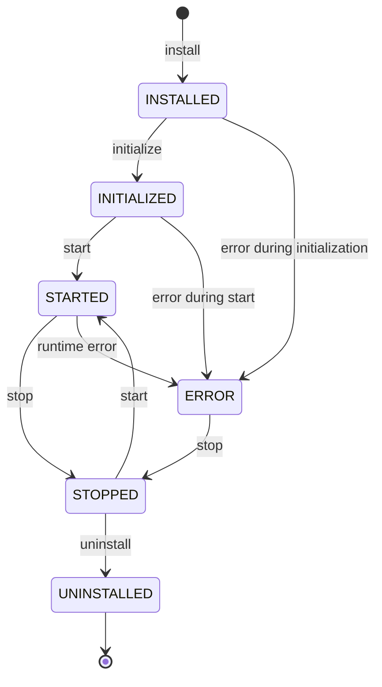

# Core Concepts

This section explains the fundamental building blocks of the Firefly Plugin Manager. Understanding these concepts is essential for effectively using and extending the plugin system.

## Table of Contents

1. [Plugins](#plugins)
2. [Extension Points](#extension-points)
3. [Extensions](#extensions)
4. [Plugin Lifecycle](#plugin-lifecycle)
5. [Plugin Metadata](#plugin-metadata)
6. [Event Bus](#event-bus)

## Plugins

A plugin is a self-contained module that adds functionality to the Firefly Platform without modifying the core codebase.

### Key Characteristics

- **Self-contained**: Packages all necessary code and resources in a single deployable unit
- **Identifiable**: Has unique metadata (ID, name, version, description, author)
- **Lifecycle-managed**: Can be installed, initialized, started, stopped, and uninstalled
- **Configurable**: Has its own configuration that can be modified at runtime
- **Dependency-aware**: Can depend on other plugins, creating a managed dependency graph
- **Isolated**: Runs in its own class loader to prevent interference with other plugins
- **Extension provider**: Contributes one or more extensions to the system

### Plugin Interface

All plugins must implement the `Plugin` interface:

```java
public interface Plugin {
    // Returns metadata about the plugin
    PluginMetadata getMetadata();

    // Called when the plugin is first loaded
    Mono<Void> initialize();

    // Called when the plugin is started
    Mono<Void> start();

    // Called when the plugin is stopped
    Mono<Void> stop();

    // Called when the plugin is being uninstalled
    Mono<Void> uninstall();
}
```

### Plugin Implementation

Most plugins extend the `AbstractPlugin` class, which provides common functionality:

```java
@Plugin(
    id = "com.example.payment.credit-card",
    name = "Credit Card Payment Processor",
    version = "1.0.0",
    description = "Processes credit card payments",
    author = "Example Inc."
)
public class CreditCardPaymentPlugin extends AbstractPlugin {
    
    private final PluginEventBus eventBus;
    private final PaymentGatewayClient gatewayClient;
    
    public CreditCardPaymentPlugin(PluginEventBus eventBus) {
        super(PluginMetadata.builder()
                .id("com.example.payment.credit-card")
                .name("Credit Card Payment Processor")
                .version("1.0.0")
                .description("Processes credit card payments")
                .author("Example Inc.")
                .build());
        
        this.eventBus = eventBus;
        this.gatewayClient = new PaymentGatewayClient();
    }
    
    @Override
    public Mono<Void> initialize() {
        logger.info("Initializing Credit Card Payment Plugin");
        return gatewayClient.initialize();
    }
    
    // Other lifecycle methods...
}
```

## Extension Points

An extension point defines a contract (interface) that specifies how a core microservice can be extended.

### Key Characteristics

- **Contract-based**: Defines a clear API that extensions must implement
- **Microservice-owned**: Defined within core microservices (e.g., core-banking-cards)
- **Identifiable**: Has a unique ID for discovery and reference
- **Configurable**: Can specify whether it allows single or multiple implementations
- **Discoverable**: Can be found dynamically at runtime
- **Stable**: Represents a long-term API contract between core and extensions

### Extension Point Definition

Extension points are typically defined as interfaces annotated with `@ExtensionPoint`:

```java
@ExtensionPoint(
    id = "com.firefly.banking.payment-processor",
    description = "Extension point for payment processing services",
    allowMultiple = true
)
public interface PaymentProcessor {
    
    /**
     * Checks if this processor supports the given payment method.
     * 
     * @param paymentMethod the payment method to check
     * @return true if this processor supports the payment method
     */
    boolean supportsPaymentMethod(String paymentMethod);
    
    /**
     * Processes a payment using this processor.
     * 
     * @param amount the payment amount
     * @param currency the payment currency
     * @param reference the payment reference
     * @return a Mono that emits the payment ID when complete
     */
    Mono<String> processPayment(BigDecimal amount, String currency, String reference);
    
    /**
     * Gets the priority of this payment processor.
     * Higher priority processors are tried first.
     * 
     * @return the priority value
     */
    int getPriority();
}
```

### Extension Point Usage

Core microservices use extension points to discover and use plugin functionality:

```java
@Service
public class PaymentService {
    
    private final PluginManager pluginManager;
    
    public PaymentService(PluginManager pluginManager) {
        this.pluginManager = pluginManager;
    }
    
    public Mono<String> processPayment(String paymentMethod, BigDecimal amount, 
                                      String currency, String reference) {
        
        return pluginManager.getExtensionRegistry()
                .getExtensions("com.firefly.banking.payment-processor")
                .cast(PaymentProcessor.class)
                .filter(processor -> processor.supportsPaymentMethod(paymentMethod))
                .sort((p1, p2) -> Integer.compare(p2.getPriority(), p1.getPriority()))
                .next()
                .switchIfEmpty(Mono.error(new UnsupportedOperationException(
                        "No payment processor found for method: " + paymentMethod)))
                .flatMap(processor -> processor.processPayment(amount, currency, reference));
    }
}
```

## Extensions

An extension is a concrete implementation of an extension point provided by a plugin.

### Key Characteristics

- **Implementation-specific**: Provides a specific implementation of an extension point
- **Plugin-owned**: Defined within plugins
- **Prioritized**: Can have a priority to determine order when multiple implementations exist
- **Configurable**: Can have its own configuration
- **Discoverable**: Can be found through the Extension Registry

### Extension Implementation

Extensions are typically defined as classes annotated with `@Extension`:

```java
@Extension(
    extensionPointId = "com.firefly.banking.payment-processor",
    priority = 100,
    description = "Processes credit card payments"
)
public class CreditCardPaymentProcessor implements PaymentProcessor {
    
    private static final Set<String> SUPPORTED_METHODS = Set.of(
            "VISA", "MASTERCARD", "AMEX", "DISCOVER");
    
    private final PaymentGatewayClient gatewayClient;
    
    public CreditCardPaymentProcessor(PaymentGatewayClient gatewayClient) {
        this.gatewayClient = gatewayClient;
    }
    
    @Override
    public boolean supportsPaymentMethod(String paymentMethod) {
        return SUPPORTED_METHODS.contains(paymentMethod.toUpperCase());
    }
    
    @Override
    public Mono<String> processPayment(BigDecimal amount, String currency, String reference) {
        return gatewayClient.processCreditCardPayment(amount, currency, reference);
    }
    
    @Override
    public int getPriority() {
        return 100;
    }
}
```

## Plugin Lifecycle

Plugins go through a well-defined lifecycle managed by the Plugin Manager:

1. **Installation**: The plugin is added to the system
2. **Initialization**: The plugin's `initialize()` method is called
3. **Starting**: The plugin's `start()` method is called
4. **Running**: The plugin is active and its extensions are available
5. **Stopping**: The plugin's `stop()` method is called
6. **Uninstallation**: The plugin's `uninstall()` method is called and it is removed

### Lifecycle States



### Lifecycle Methods

Each lifecycle method returns a `Mono<Void>` to indicate completion:

- **initialize()**: Set up resources, load configuration, prepare the plugin
- **start()**: Activate the plugin, register extensions, subscribe to events
- **stop()**: Deactivate the plugin, unregister extensions, unsubscribe from events
- **uninstall()**: Clean up resources, remove configuration, prepare for removal

## Plugin Metadata

Plugin metadata provides information about a plugin:

```java
PluginMetadata metadata = PluginMetadata.builder()
        .id("com.example.payment.credit-card")
        .name("Credit Card Payment Processor")
        .version("1.0.0")
        .description("Processes credit card payments with support for major card networks")
        .author("Example Inc.")
        .minPlatformVersion("1.0.0")
        .maxPlatformVersion("2.0.0")
        .dependencies(Set.of("com.example.common-utils"))
        .installTime(Instant.now())
        .build();
```

### Metadata Fields

- **id**: Unique identifier for the plugin (use reverse-domain naming convention)
- **name**: Human-readable name
- **version**: Version number (using semantic versioning)
- **description**: Description of functionality
- **author**: Author or organization
- **minPlatformVersion**: Minimum required platform version
- **maxPlatformVersion**: Maximum compatible platform version (optional)
- **dependencies**: IDs of other plugins this plugin depends on
- **installTime**: When the plugin was installed

## Event Bus

The event bus enables communication between plugins and other components:

```java
// Publishing an event
eventBus.publish("payment.processed", Map.of(
        "paymentId", paymentId,
        "amount", amount,
        "currency", currency,
        "timestamp", Instant.now()
));

// Subscribing to events
Disposable subscription = eventBus.subscribe("payment.processed", event -> {
    Map<String, Object> data = event.getData();
    String paymentId = (String) data.get("paymentId");
    BigDecimal amount = (BigDecimal) data.get("amount");
    
    logger.info("Payment processed: {} for {}", paymentId, amount);
});
```

### Event Bus Features

- **Topic-based**: Events are organized by topics (e.g., "payment.processed")
- **Reactive**: Based on Reactor for non-blocking event processing
- **Type-safe**: Events can carry typed data
- **Flexible**: Supports both point-to-point and publish-subscribe patterns
- **Pluggable**: Can use in-memory implementation or Kafka for distributed events

### Event Types

- **System Events**: Generated by the Plugin Manager (e.g., plugin.installed, plugin.started)
- **Plugin Events**: Generated by plugins for inter-plugin communication
- **Application Events**: Generated by the application for general communication

By understanding these core concepts, you'll have a solid foundation for working with the Firefly Plugin Manager. The next sections will build on these concepts to show you how to create and use plugins effectively.
