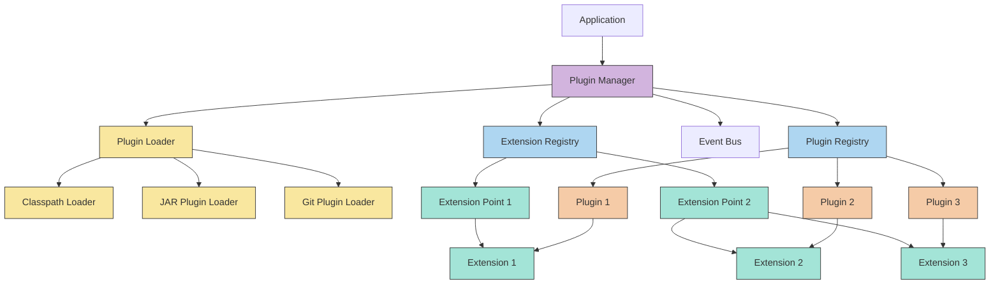
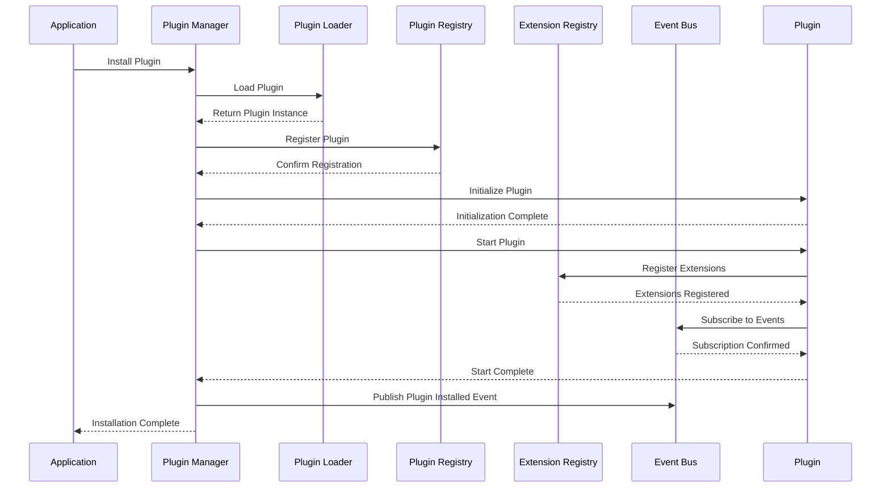
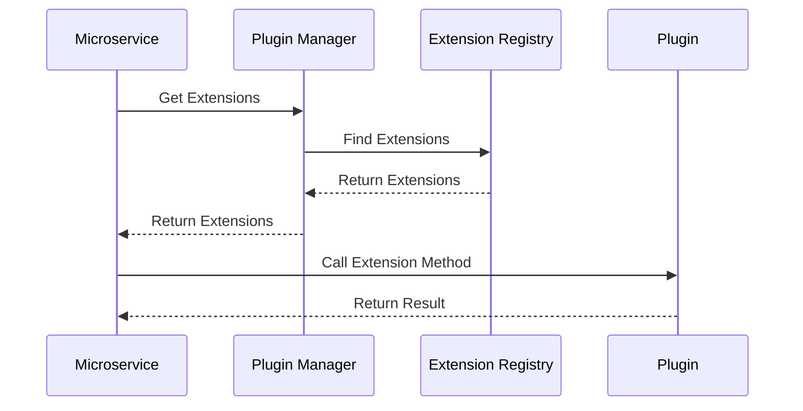
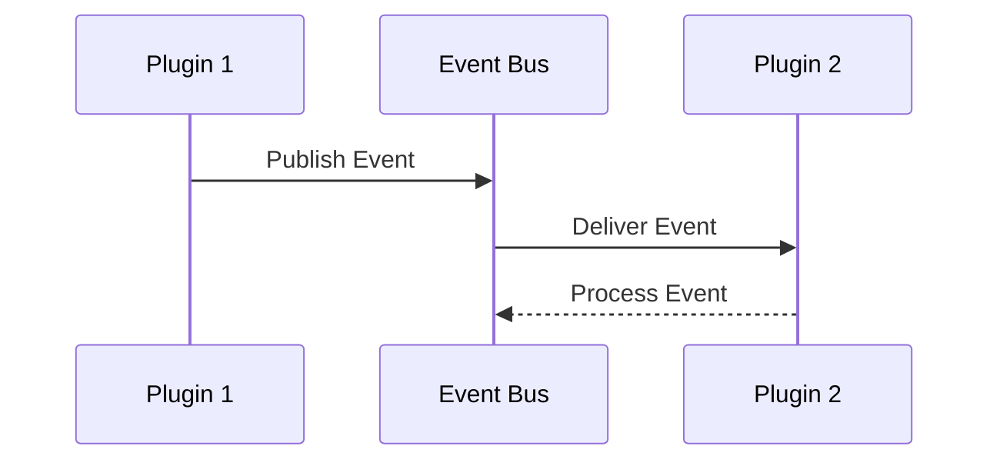

# Architecture Overview

This section provides a detailed look at the architecture of the Firefly Plugin Manager, explaining how its components work together to create a flexible, extensible system.

## Table of Contents

1. [High-Level Architecture](#high-level-architecture)
2. [Plugin Registry](#plugin-registry)
3. [Extension Registry](#extension-registry)
4. [Event Bus](#event-bus)
5. [Plugin Loader](#plugin-loader)
6. [Utility Classes](#utility-classes)
7. [Component Interactions](#component-interactions)

## High-Level Architecture

The Firefly Plugin Manager uses a modular architecture with several key components:



This architecture provides:

- **Separation of Concerns**: Each component has a specific responsibility
- **Flexibility**: Components can be replaced or extended
- **Scalability**: The system can handle many plugins and extensions
- **Maintainability**: Changes to one component don't affect others

## Plugin Registry

The Plugin Registry is the central repository for all plugins in the system.

### Responsibilities

- **Plugin Storage**: Maintains a registry of all installed plugins
- **Lifecycle Management**: Tracks and manages plugin lifecycle states
- **Dependency Resolution**: Ensures plugins are loaded in the correct order
- **Plugin Lookup**: Provides methods to find plugins by ID or other criteria
- **Plugin Metadata**: Stores and provides access to plugin metadata

### Key Methods

```java
// Register a plugin
Mono<Void> registerPlugin(Plugin plugin);

// Unregister a plugin
Mono<Void> unregisterPlugin(String pluginId);

// Get a plugin by ID
Mono<Plugin> getPlugin(String pluginId);

// Get all plugins
Flux<Plugin> getAllPlugins();

// Get plugins by state
Flux<Plugin> getPluginsByState(PluginState state);

// Update plugin configuration
Mono<Void> updatePluginConfiguration(String pluginId, Map<String, Object> configuration);
```

### Implementation

The Plugin Registry uses a concurrent map to store plugins, ensuring thread safety:

```java
public class DefaultPluginRegistry implements PluginRegistry {
    
    private final ConcurrentMap<String, Plugin> plugins = new ConcurrentHashMap<>();
    private final ConcurrentMap<String, PluginState> pluginStates = new ConcurrentHashMap<>();
    
    @Override
    public Mono<Void> registerPlugin(Plugin plugin) {
        String pluginId = plugin.getMetadata().id();
        
        return Mono.fromCallable(() -> {
            if (plugins.containsKey(pluginId)) {
                throw new PluginException("Plugin already registered: " + pluginId);
            }
            
            plugins.put(pluginId, plugin);
            pluginStates.put(pluginId, PluginState.INSTALLED);
            return null;
        });
    }
    
    // Other methods...
}
```

## Extension Registry

The Extension Registry manages extension points and their implementations.

### Responsibilities

- **Extension Point Registration**: Registers extension points defined by microservices
- **Extension Registration**: Registers extensions provided by plugins
- **Extension Lookup**: Finds extensions for a given extension point
- **Extension Validation**: Ensures extensions implement the correct interface
- **Extension Prioritization**: Sorts extensions by priority

### Key Methods

```java
// Register an extension point
Mono<Void> registerExtensionPoint(ExtensionPoint extensionPoint);

// Register an extension
Mono<Void> registerExtension(Extension extension);

// Get extensions for an extension point
Flux<Object> getExtensions(String extensionPointId);

// Get the highest priority extension
Mono<Object> getHighestPriorityExtension(String extensionPointId);

// Get extension points
Flux<ExtensionPoint> getExtensionPoints();
```

### Implementation

The Extension Registry maintains mappings between extension points and their implementations:

```java
public class DefaultExtensionRegistry implements ExtensionRegistry {
    
    private final ConcurrentMap<String, ExtensionPoint> extensionPoints = new ConcurrentHashMap<>();
    private final ConcurrentMap<String, List<ExtensionEntry>> extensions = new ConcurrentHashMap<>();
    
    @Override
    public Mono<Void> registerExtension(Extension extension) {
        return Mono.fromCallable(() -> {
            String extensionPointId = extension.getExtensionPointId();
            
            if (!extensionPoints.containsKey(extensionPointId)) {
                throw new ExtensionException("Extension point not found: " + extensionPointId);
            }
            
            ExtensionPoint extensionPoint = extensionPoints.get(extensionPointId);
            Class<?> extensionPointClass = extensionPoint.getClass();
            
            if (!extensionPointClass.isAssignableFrom(extension.getClass())) {
                throw new ExtensionException("Extension does not implement extension point: " + 
                        extension.getClass().getName() + " does not implement " + 
                        extensionPointClass.getName());
            }
            
            List<ExtensionEntry> extensionList = extensions.computeIfAbsent(
                    extensionPointId, k -> new CopyOnWriteArrayList<>());
            
            ExtensionEntry entry = new ExtensionEntry(extension, extension.getPriority());
            extensionList.add(entry);
            
            // Sort by priority (higher first)
            extensionList.sort((e1, e2) -> Integer.compare(e2.priority(), e1.priority()));
            
            return null;
        });
    }
    
    // Other methods...
}
```

## Event Bus

The Event Bus enables communication between plugins and other components.

### Responsibilities

- **Event Publication**: Allows components to publish events
- **Event Subscription**: Allows components to subscribe to events
- **Event Routing**: Delivers events to the appropriate subscribers
- **Event Filtering**: Allows subscribers to filter events
- **Event Transformation**: Allows events to be transformed

### Event Bus Implementations

The Plugin Manager provides two implementations of the event bus:

1. **In-Memory Event Bus**: For local, in-process communication
2. **Kafka Event Bus**: For distributed, cross-process communication

### In-Memory Event Bus

```java
public class InMemoryEventBus implements PluginEventBus {
    
    private final ConcurrentMap<String, List<Subscriber>> subscribers = new ConcurrentHashMap<>();
    
    @Override
    public Disposable subscribe(String topic, Consumer<Event> handler) {
        Subscriber subscriber = new Subscriber(topic, handler);
        
        subscribers.computeIfAbsent(topic, k -> new CopyOnWriteArrayList<>())
                .add(subscriber);
        
        return Disposables.composite(() -> {
            List<Subscriber> topicSubscribers = subscribers.get(topic);
            if (topicSubscribers != null) {
                topicSubscribers.remove(subscriber);
            }
        });
    }
    
    @Override
    public void publish(String topic, Map<String, Object> data) {
        Event event = new Event(topic, data);
        
        List<Subscriber> topicSubscribers = subscribers.get(topic);
        if (topicSubscribers != null) {
            for (Subscriber subscriber : topicSubscribers) {
                try {
                    subscriber.handler().accept(event);
                } catch (Exception e) {
                    logger.error("Error handling event: {}", topic, e);
                }
            }
        }
    }
    
    // Other methods...
}
```

### Kafka Event Bus

```java
public class KafkaEventBus implements PluginEventBus {
    
    private final KafkaProducer<String, String> producer;
    private final KafkaConsumer<String, String> consumer;
    private final ObjectMapper objectMapper;
    private final ConcurrentMap<String, List<Subscriber>> subscribers = new ConcurrentHashMap<>();
    
    // Constructor and initialization...
    
    @Override
    public void publish(String topic, Map<String, Object> data) {
        try {
            String json = objectMapper.writeValueAsString(data);
            ProducerRecord<String, String> record = new ProducerRecord<>(topic, json);
            producer.send(record);
        } catch (JsonProcessingException e) {
            logger.error("Error serializing event data: {}", topic, e);
        }
    }
    
    // Other methods...
}
```

## Plugin Loader

The Plugin Loader is responsible for loading plugins from various sources.

### Responsibilities

- **Plugin Discovery**: Finds plugins from different sources
- **Plugin Loading**: Loads plugin classes and creates instances
- **Class Isolation**: Ensures plugins have their own class loaders
- **Resource Management**: Manages resources used by plugins
- **Plugin Validation**: Validates plugin metadata and structure

### Plugin Loading Methods

The Plugin Manager supports three ways to load plugins:

1. **JAR File Loading**: Load plugins from JAR files
2. **Git Repository Loading**: Load plugins from Git repositories
3. **Classpath Loading**: Load plugins from the application classpath

### JAR Plugin Loader

```java
public class JarPluginLoader implements PluginLoader {
    
    @Override
    public Flux<Plugin> loadPlugins(Path directory) {
        return Flux.fromIterable(ResourceUtils.listFiles(directory, path -> 
                path.toString().endsWith(".jar")))
                .flatMap(this::loadPluginFromJar);
    }
    
    private Mono<Plugin> loadPluginFromJar(Path jarPath) {
        return Mono.fromCallable(() -> {
            URL jarUrl = jarPath.toUri().toURL();
            URLClassLoader classLoader = new URLClassLoader(
                    new URL[] { jarUrl }, 
                    getClass().getClassLoader());
            
            // Load plugin class from JAR
            ServiceLoader<Plugin> serviceLoader = ServiceLoader.load(Plugin.class, classLoader);
            Iterator<Plugin> iterator = serviceLoader.iterator();
            
            if (iterator.hasNext()) {
                return iterator.next();
            } else {
                throw new PluginException("No plugin found in JAR: " + jarPath);
            }
        });
    }
}
```

### Git Plugin Loader

```java
public class GitPluginLoader implements PluginLoader {
    
    private final GitClient gitClient;
    private final Path pluginsDirectory;
    
    // Constructor and initialization...
    
    @Override
    public Flux<Plugin> loadPlugins(String repositoryUrl) {
        return Mono.fromCallable(() -> {
            // Clone or pull the repository
            Path repoPath = gitClient.cloneOrPull(repositoryUrl, pluginsDirectory);
            
            // Build the plugin
            Path buildOutput = buildPlugin(repoPath);
            
            // Load the plugin from the build output
            return loadPluginFromJar(buildOutput);
        }).flux();
    }
    
    // Other methods...
}
```

### Classpath Plugin Loader

```java
public class ClasspathPluginLoader implements PluginLoader {
    
    @Override
    public Flux<Plugin> loadPlugins(String packageName) {
        return Flux.fromIterable(() -> {
            // Find all classes with @Plugin annotation in the package
            Reflections reflections = new Reflections(packageName);
            Set<Class<?>> pluginClasses = reflections.getTypesAnnotatedWith(Plugin.class);
            
            return pluginClasses.iterator();
        }).flatMap(this::createPluginInstance);
    }
    
    private Mono<Plugin> createPluginInstance(Class<?> pluginClass) {
        return Mono.fromCallable(() -> {
            // Create an instance of the plugin class
            if (Plugin.class.isAssignableFrom(pluginClass)) {
                try {
                    Constructor<?> constructor = pluginClass.getConstructor();
                    return (Plugin) constructor.newInstance();
                } catch (Exception e) {
                    throw new PluginException("Error creating plugin instance: " + 
                            pluginClass.getName(), e);
                }
            } else {
                throw new PluginException("Class is not a plugin: " + pluginClass.getName());
            }
        });
    }
}
```

## Utility Classes

The Plugin Manager provides several utility classes to help with common tasks:

### ClassLoaderUtils

Simplifies class loading operations:

```java
public class ClassLoaderUtils {
    
    /**
     * Loads a class with the given name.
     * 
     * @param className the name of the class to load
     * @return an Optional containing the class, or empty if not found
     */
    public static Optional<Class<?>> loadClass(String className) {
        try {
            return Optional.of(Class.forName(className));
        } catch (ClassNotFoundException e) {
            logger.debug("Class not found: {}", className);
            return Optional.empty();
        }
    }
    
    /**
     * Creates an instance of the given class.
     * 
     * @param className the name of the class to instantiate
     * @return an Optional containing the instance, or empty if not created
     */
    public static Optional<Object> createInstance(String className) {
        return loadClass(className).flatMap(clazz -> {
            try {
                return Optional.of(clazz.getDeclaredConstructor().newInstance());
            } catch (Exception e) {
                logger.error("Error creating instance of class: {}", className, e);
                return Optional.empty();
            }
        });
    }
    
    // Other methods...
}
```

### ResourceUtils

Provides utilities for resource management:

```java
public class ResourceUtils {
    
    /**
     * Reads a file as a string.
     * 
     * @param path the path to the file
     * @return an Optional containing the file content, or empty if not read
     */
    public static Optional<String> readFileAsString(Path path) {
        try {
            return Optional.of(Files.readString(path));
        } catch (IOException e) {
            logger.error("Error reading file: {}", path, e);
            return Optional.empty();
        }
    }
    
    /**
     * Lists all files in a directory that match a predicate.
     * 
     * @param directory the directory to list
     * @param predicate the predicate to apply
     * @return a list of paths to the matching files
     */
    public static List<Path> listFiles(Path directory, java.util.function.Predicate<Path> predicate) {
        if (!Files.isDirectory(directory)) {
            logger.warn("Not a directory: {}", directory);
            return List.of();
        }
        
        try (Stream<Path> paths = Files.list(directory)) {
            return paths.filter(predicate).collect(Collectors.toList());
        } catch (IOException e) {
            logger.warn("Error listing files in directory: {}", directory, e);
            return List.of();
        }
    }
    
    // Other methods...
}
```

### PluginUtils

Provides utilities specific to plugin management:

```java
public class PluginUtils {
    
    /**
     * Extracts the plugin ID from a filename.
     * 
     * @param filename the filename to parse
     * @return the plugin ID
     */
    public static String extractPluginIdFromFileName(String filename) {
        // Remove file extension
        int extensionIndex = filename.lastIndexOf('.');
        if (extensionIndex > 0) {
            filename = filename.substring(0, extensionIndex);
        }
        
        // Remove version if present (e.g., "plugin-1.0.0" -> "plugin")
        int versionIndex = filename.lastIndexOf('-');
        if (versionIndex > 0 && isVersionSuffix(filename.substring(versionIndex + 1))) {
            filename = filename.substring(0, versionIndex);
        }
        
        return filename;
    }
    
    private static boolean isVersionSuffix(String suffix) {
        // Simple check for version pattern (e.g., "1.0.0")
        return suffix.matches("\\d+(\\.\\d+)*");
    }
    
    // Other methods...
}
```

## Component Interactions

The components of the Plugin Manager work together to provide a seamless plugin experience:

### Plugin Installation Flow



### Extension Usage Flow



### Event Communication Flow



This architecture provides a flexible, extensible foundation for the Firefly Plugin Manager, allowing it to support a wide range of plugin scenarios while maintaining stability and performance.
