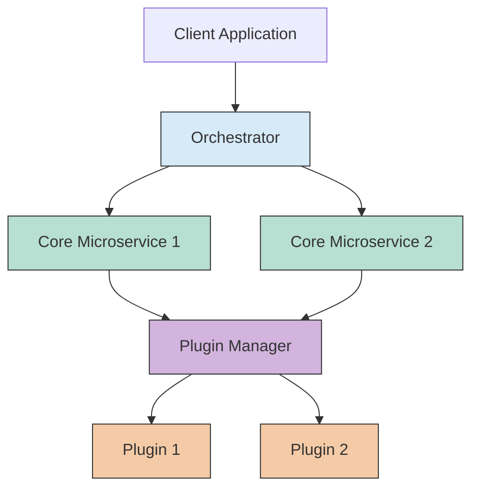
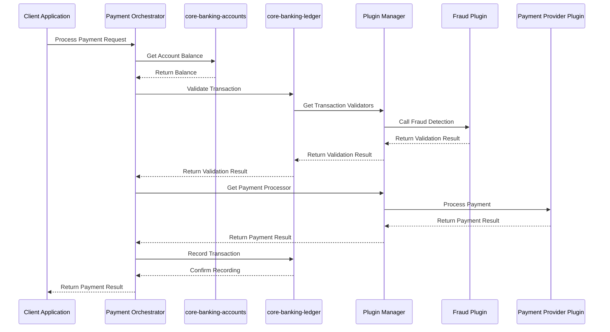

# Microservice vs Plugin Responsibilities

This guide provides a clear explanation of what logic belongs in core microservices versus plugin projects in the Firefly Plugin Manager architecture.

## Table of Contents

1. [Architectural Overview](#architectural-overview)
2. [Core Microservice Responsibilities](#core-microservice-responsibilities)
3. [Plugin Project Responsibilities](#plugin-project-responsibilities)
4. [Integration Points](#integration-points)
5. [Decision Framework](#decision-framework)
6. [Real-World Examples](#real-world-examples)

## Architectural Overview

The Firefly Platform uses a three-tier architecture to separate responsibilities:

1. **Core Microservices**: Foundation services that manage data and define extension points
2. **Orchestrators**: Business process coordinators that implement workflows across services
3. **Plugins**: Customizable extensions that implement specific functionality

This separation creates a system that is:
- **Stable**: Core services change infrequently
- **Flexible**: Business processes can be modified without changing core services
- **Extensible**: New features can be added through plugins without modifying existing code



## Core Microservice Responsibilities

Core microservices form the foundation of the system and have these key responsibilities:

### 1. Data Management

- **CRUD Operations**: Create, read, update, and delete domain entities
- **Data Validation**: Basic validation of entity fields and relationships
- **Data Storage**: Persistence of domain data
- **Data Retrieval**: Efficient querying of domain data

### 2. Extension Point Definition

- **Interface Contracts**: Define clear APIs that plugins must implement
- **Extension Point Metadata**: Provide information about extension capabilities
- **Extension Point Documentation**: Document how extensions should behave

### 3. Basic Domain Logic

- **Entity Relationships**: Manage relationships between domain entities
- **Business Rules**: Implement fundamental, unchanging business rules
- **Data Integrity**: Ensure consistency and integrity of domain data

### 4. API Exposure

- **REST Endpoints**: Expose domain data through RESTful APIs
- **Reactive Streams**: Provide reactive interfaces for data access
- **API Documentation**: Document API contracts and usage

### Example: Core Microservice Code

```java
// In core-banking-accounts microservice
@ExtensionPoint(
    id = "com.firefly.banking.accounts.account-enricher",
    description = "Extension point for enriching account information",
    allowMultiple = true
)
public interface AccountEnricher {
    /**
     * Enriches an account with additional information.
     * 
     * @param account The account to enrich
     * @return A Mono emitting the enriched account
     */
    Mono<Account> enrichAccount(Account account);
    
    /**
     * Returns the priority of this enricher.
     * Higher priority enrichers are applied first.
     * 
     * @return the priority value
     */
    int getPriority();
    
    /**
     * Returns the name of this enricher.
     * 
     * @return the enricher name
     */
    String getEnricherName();
}
```

## Plugin Project Responsibilities

Plugins extend and customize the core functionality and have these key responsibilities:

### 1. Extension Implementation

- **Extension Classes**: Concrete implementations of extension points
- **Custom Business Logic**: Specialized logic that extends core functionality
- **Third-Party Integrations**: Connections to external systems and services

### 2. Plugin Lifecycle Management

- **Initialization**: Set up resources and connections
- **Configuration**: Handle plugin-specific configuration
- **Cleanup**: Release resources when the plugin is stopped

### 3. Event Handling

- **Event Subscription**: Listen for relevant system events
- **Event Publication**: Publish events for other components
- **Event Processing**: Process events according to plugin logic

### 4. Custom Features

- **Institution-Specific Logic**: Implement features specific to a financial institution
- **Specialized Algorithms**: Implement custom algorithms (e.g., fraud detection)
- **UI Extensions**: Provide custom UI components (if applicable)

### Example: Plugin Code

```java
@Plugin(
    id = "com.example.enrichment.company-info",
    name = "Company Information Enricher",
    version = "1.0.0",
    description = "Enriches accounts with company information",
    author = "Example Inc."
)
public class CompanyInfoPlugin extends AbstractPlugin {
    
    private final CompanyInfoClient client;
    private final PluginEventBus eventBus;
    
    public CompanyInfoPlugin(PluginEventBus eventBus) {
        super(PluginMetadata.builder()
                .id("com.example.enrichment.company-info")
                .name("Company Information Enricher")
                .version("1.0.0")
                .description("Enriches accounts with company information")
                .author("Example Inc.")
                .build());
        
        this.eventBus = eventBus;
        this.client = new CompanyInfoClient();
    }
    
    @Override
    public Mono<Void> initialize() {
        logger.info("Initializing Company Information Plugin");
        return client.initialize();
    }
    
    @Extension(
        extensionPointId = "com.firefly.banking.accounts.account-enricher",
        priority = 100,
        description = "Enriches accounts with company information"
    )
    public class CompanyInfoEnricher implements AccountEnricher {
        
        @Override
        public Mono<Account> enrichAccount(Account account) {
            // Only enrich business accounts
            if (!"BUSINESS".equals(account.getType())) {
                return Mono.just(account);
            }
            
            String companyId = account.getMetadata().get("companyId");
            if (companyId == null) {
                return Mono.just(account);
            }
            
            return client.getCompanyInfo(companyId)
                    .map(companyInfo -> {
                        // Enrich the account with company information
                        account.getMetadata().put("companyName", companyInfo.getName());
                        account.getMetadata().put("companySize", companyInfo.getSize());
                        account.getMetadata().put("industrySector", companyInfo.getSector());
                        account.getMetadata().put("foundingYear", companyInfo.getFoundingYear());
                        account.getMetadata().put("creditRating", companyInfo.getCreditRating());
                        return account;
                    })
                    .defaultIfEmpty(account);
        }
        
        @Override
        public int getPriority() {
            return 100;
        }
        
        @Override
        public String getEnricherName() {
            return "Company Information Enricher";
        }
    }
}
```

## Integration Points

The integration between core microservices and plugins happens through several well-defined mechanisms:

### 1. Extension Points

Extension points are the primary integration mechanism:

- **Defined in Core Microservices**: Core services define the extension point interfaces
- **Implemented by Plugins**: Plugins provide concrete implementations
- **Connected by Plugin Manager**: The Plugin Manager connects them at runtime

### 2. Event Bus

The event bus enables loose coupling between components:

- **In-Memory or Kafka**: Events can be published locally or distributed
- **Topic-Based**: Events are organized by topics
- **Reactive**: Based on Reactor for non-blocking event processing

### 3. Shared Data Models

Core microservices and plugins share common data models:

- **Domain Entities**: Core entities like Account, Transaction, Customer
- **DTOs**: Data transfer objects for API communication
- **Events**: Event objects for inter-component communication

### 4. Configuration

Configuration provides a way to customize behavior:

- **Plugin Configuration**: Each plugin has its own configuration
- **Extension Point Configuration**: Extension points can be configured
- **System-Wide Configuration**: Global settings that affect all components

## Decision Framework

Use this decision framework to determine where functionality should be implemented:

### Place Logic in Core Microservices When:

- It involves fundamental data operations (CRUD)
- It implements unchanging business rules
- It defines core domain models
- It provides stable APIs that many components will use
- It requires direct database access
- It's essential for the system to function

### Place Logic in Plugins When:

- It's specific to certain institutions or use cases
- It integrates with external systems
- It implements algorithms that may change or vary
- It extends or customizes core functionality
- It's optional for the system to function
- It needs to be deployed or updated independently

### Place Logic in Orchestrators When:

- It coordinates processes across multiple services
- It implements complex business workflows
- It handles cross-domain validation
- It manages compensating transactions
- It implements business-specific process logic

## Real-World Examples

### Example 1: Account Management

| Functionality | Location | Rationale |
|--------------|----------|-----------|
| Account data storage | Core Microservice | Fundamental data management |
| Basic account validation | Core Microservice | Essential data integrity |
| Account enrichment extension point | Core Microservice | Stable extension contract |
| Company information enrichment | Plugin | Integration with external data source |
| Account opening workflow | Orchestrator | Complex business process |

### Example 2: Payment Processing

| Functionality | Location | Rationale |
|--------------|----------|-----------|
| Transaction data storage | Core Microservice | Fundamental data management |
| Payment processor extension point | Core Microservice | Stable extension contract |
| Credit card payment processing | Plugin | Specific payment method implementation |
| Payment gateway integration | Plugin | External system integration |
| End-to-end payment workflow | Orchestrator | Complex business process |

### Example 3: Fraud Detection

| Functionality | Location | Rationale |
|--------------|----------|-----------|
| Fraud detector extension point | Core Microservice | Stable extension contract |
| Basic fraud rules | Core Microservice | Essential validation |
| Machine learning fraud detection | Plugin | Specialized algorithm |
| External fraud database integration | Plugin | External system integration |
| Fraud investigation workflow | Orchestrator | Complex business process |

## Sequence Diagram: Payment Processing Example



This diagram shows how:
1. The orchestrator coordinates the overall process
2. Core microservices handle data operations
3. Plugins provide specialized functionality
4. The Plugin Manager connects microservices with plugin implementations

By following these guidelines, you can create a clean separation of responsibilities that makes your system more maintainable, flexible, and extensible.
