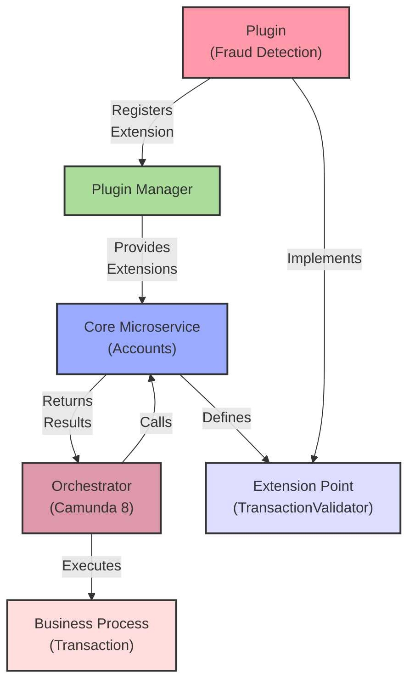
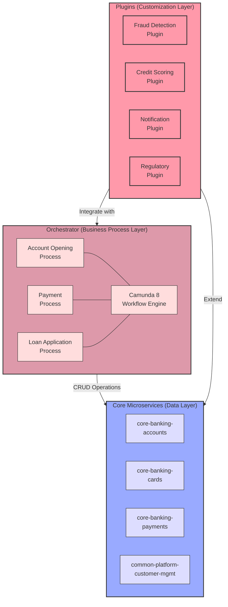
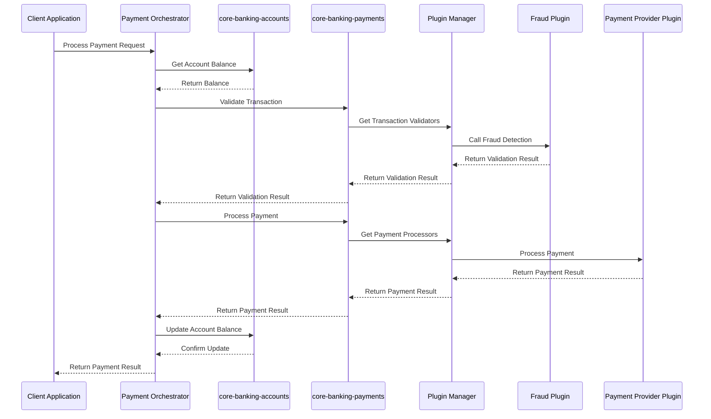

# Microservice vs Plugin Responsibilities

This document provides a comprehensive guide to understanding what logic belongs in core microservices versus plugin projects in the Firefly Plugin Manager architecture.

## Table of Contents

1. [Introduction](#introduction)
2. [Architectural Overview](#architectural-overview)
3. [Core Microservice Responsibilities](#core-microservice-responsibilities)
4. [Plugin Project Responsibilities](#plugin-project-responsibilities)
5. [Integration Points](#integration-points)
6. [Best Practices](#best-practices)
7. [Examples](#examples)

## Introduction

Imagine you're building a house. The foundation, walls, roof, and basic plumbing are essential parts that rarely change - these are like your **core microservices**. But the interior decoration, furniture, and smart home devices that make the house uniquely yours are like **plugins** - they can be added, removed, or changed without affecting the house's structure.

The Firefly Plugin Manager architecture works on this same principle. It separates banking software into two main parts:

1. **Core Microservices**: The essential banking functions that rarely change (like creating accounts, processing transactions, and maintaining balances)

2. **Plugins**: Customizable features that can be added or modified without changing the core (like fraud detection algorithms, notification systems, or integration with external services)

This separation makes the system:
- **More stable**: Core functions remain untouched when adding custom features
- **More flexible**: New features can be added without modifying core code
- **Easier to maintain**: Changes in one area don't unexpectedly break others
- **More scalable**: Different teams can work on core and custom features independently

This document will help you understand:
- What functionality should be implemented in core microservices (and why)
- What functionality should be implemented in plugins (and why)
- How these components interact with each other (with real examples)
- Best practices for maintaining a clean separation of concerns

By the end of this guide, you'll be able to confidently decide where new functionality belongs in your banking system, whether you're a developer, architect, or product manager.

## Architectural Overview

Let's break down the Firefly Platform architecture using a real-world analogy: think of it like a modern smartphone system.

- **Core Microservices** are like the phone's built-in apps (Phone, Messages, Settings)
- **Plugins** are like apps you download from the app store
- **Plugin Manager** is like the operating system that manages all the apps
- **Extension Points** are like the APIs that let downloaded apps access the phone's camera or contacts
- **Extensions** are the actual implementations that use those APIs

### Key Components Explained

1. **Core Microservices**: These are separate, specialized applications that handle fundamental banking data operations (CRUD). For example:
   - `core-banking-accounts`: Manages customer accounts, balances, and transactions data
   - `core-banking-cards`: Handles credit and debit card operations data
   - `core-banking-payments`: Processes various payment types data
   - `common-platform-customer-mgmt`: Manages customer information and relationships
   - `core-banking-ledger`: Manages accounting entries and financial records

   Each microservice focuses on a specific domain's data management and provides basic CRUD operations. They typically don't contain complex business logic or orchestration between domains.

2. **Plugin Manager**: This is the central system that:
   - Discovers and loads plugins
   - Manages their lifecycle (installation, starting, stopping, uninstallation)
   - Enforces security boundaries
   - Connects plugins with microservices
   - Handles configuration and updates

   Think of it as the "app store" and "operating system" for banking plugins.

3. **Plugins**: These are self-contained modules that add specific functionality. Examples include:
   - A fraud detection plugin that uses machine learning
   - A regulatory reporting plugin for a specific country
   - A customer notification plugin that sends SMS alerts
   - A loyalty program plugin that awards points for transactions

4. **Extension Points**: These are clearly defined interfaces in core microservices that specify how they can be extended. For example:
   - `AccountEnrichmentExtensionPoint`: Allows adding extra information to accounts
   - `TransactionValidatorExtensionPoint`: Enables custom transaction validation rules
   - `PaymentProcessorExtensionPoint`: Permits adding new payment methods

5. **Extensions**: These are the actual implementations of extension points provided by plugins. For example:
   - `BusinessAccountEnricher`: Adds company information to business accounts
   - `AMLTransactionValidator`: Validates transactions against anti-money laundering rules
   - `CreditCardProcessor`: Processes credit card payments

6. **Orchestrator**: This is a specialized service built with Camunda 8 and Spring Boot 3 WebFlux that:
   - Contains the complex business logic and workflows
   - Orchestrates calls between different core microservices
   - Coordinates interactions with external services
   - Manages long-running business processes
   - Handles error recovery and compensation logic
   - Provides visibility into process execution

   The Orchestrator is where the actual business flows are implemented, while core microservices focus on data management. For example, an account opening process in the Orchestrator would coordinate calls to customer management, account creation, card issuance, and notification services.

### Interaction Flow with Example



Let's walk through a concrete example of how this works with the Orchestrator:

1. The `core-banking-accounts` microservice defines a `TransactionValidatorExtensionPoint` interface that specifies how transactions can be validated before processing

2. A fraud detection plugin implements this interface with a `MachineLearningFraudValidator` class that uses AI to detect suspicious transactions

3. When the plugin is installed and started, it registers its validator with the Plugin Manager

4. The Orchestrator service contains a "Process Payment" business process implemented as a Camunda 8 workflow

5. When a customer initiates a transaction, the Orchestrator:
   - Calls the accounts microservice to retrieve account information
   - Calls other microservices as needed (e.g., customer information, balance checks)
   - Before finalizing the transaction, it needs to validate it

6. The accounts microservice asks the Plugin Manager: "Give me all transaction validators"

7. The Plugin Manager returns the `MachineLearningFraudValidator` (and any other validators from other plugins)

8. The accounts microservice runs each validator on the transaction

9. If the fraud validator detects suspicious activity, it returns a "rejected" result with a reason

10. The accounts microservice returns this result to the Orchestrator

11. The Orchestrator then decides what to do next based on the workflow definition (e.g., decline the transaction, request additional verification, or proceed)

This architecture separates responsibilities clearly:
- The **Orchestrator** handles the business process and workflow logic
- The **Core Microservice** handles data operations and extension point definitions
- The **Plugin** provides specialized implementation of the extension point
- The **Plugin Manager** connects the plugins to the core microservices

All of this happens without modifying the core microservice's code. The accounts service doesn't need to know the details of how fraud detection works - it just needs to know how to use validators through the extension point interface.

## Core Microservice Responsibilities

Core microservices are the data management foundation of your banking system. Unlike traditional monolithic applications where business logic and data access are combined, in the Firefly architecture, core microservices focus primarily on data operations (CRUD - Create, Read, Update, Delete) while complex business logic resides in the Orchestrator.

Think of core microservices as specialized database services that provide well-defined APIs for accessing and manipulating domain-specific data, while the Orchestrator acts as the conductor that coordinates these services to implement business processes.

Let's explore what belongs in core microservices with clear examples:

### 1. Basic Domain Logic

Core microservices contain only the essential domain logic needed for data validation and integrity. Complex business rules and processes are implemented in the Orchestrator.

#### Data Validation Rules

**Example: Account Number Validation**

```java
// This belongs in a core microservice because it validates the format of account numbers
public boolean isValidAccountNumber(String accountNumber) {
    // Check length
    if (accountNumber == null || accountNumber.length() != 10) {
        return false;
    }

    // Check that it contains only digits
    if (!accountNumber.matches("\\d+")) {
        return false;
    }

    // Validate check digit (last digit)
    int sum = 0;
    for (int i = 0; i < 9; i++) {
        sum += Character.getNumericValue(accountNumber.charAt(i)) * (9 - i);
    }
    int checkDigit = sum % 11;
    if (checkDigit == 10) checkDigit = 0;

    return checkDigit == Character.getNumericValue(accountNumber.charAt(9));
}
```

#### Simple Data Calculations

**Example: Current Balance Calculation**

```java
// This belongs in a core microservice because it's a simple calculation on account data
public BigDecimal getCurrentBalance(String accountId) {
    // Get the account's base balance
    Account account = accountRepository.findById(accountId)
        .orElseThrow(() -> new AccountNotFoundException(accountId));

    // Return the current balance
    return account.getCurrentBalance();
}
```

> **Note**: Complex business logic like calculating available balance considering pending transactions, credit limits, and holds would be implemented in the Orchestrator, not in the core microservice.

#### Basic Regulatory Data Capture

**Example: Transaction Data Storage**

```java
// This belongs in a core microservice because it stores required transaction data
public Mono<Transaction> saveTransaction(Transaction transaction) {
    // Set audit fields
    if (transaction.getId() == null) {
        transaction.setId(UUID.randomUUID().toString());
        transaction.setCreatedDate(Instant.now());
    }
    transaction.setLastModifiedDate(Instant.now());

    // Store the transaction
    return transactionRepository.save(transaction);
}
```

> **Note**: Complex regulatory reporting logic, decision-making about which transactions need special handling, and coordination with reporting services would be implemented in the Orchestrator.

### 2. Extension Points

Extension points are the "pluggable sockets" in your core microservices that allow plugins to add functionality.

#### Interface Definitions

**Example: Transaction Validator Extension Point**

```java
// This belongs in a core microservice because it defines how plugins can validate transactions
public interface TransactionValidatorExtensionPoint {
    /**
     * Validates a transaction before it's processed.
     *
     * @param transaction The transaction to validate
     * @return A validation result indicating whether the transaction is valid
     */
    Mono<ValidationResult> validateTransaction(Transaction transaction);

    /**
     * Returns the name of this validator for logging and monitoring.
     */
    String getValidatorName();

    /**
     * Returns the priority of this validator (higher values run first).
     */
    default int getPriority() {
        return 0;
    }

    /**
     * Indicates whether this validator applies to the given transaction type.
     */
    boolean supportsTransactionType(TransactionType type);
}
```

#### Extension Point Registration

**Example: Registering Extension Points**

```java
// This belongs in a core microservice because it makes extension points available to plugins
@Configuration
public class TransactionExtensionConfig {

    @Autowired
    private ExtensionRegistry extensionRegistry;

    @PostConstruct
    public void registerExtensionPoints() {
        // Register the transaction validator extension point
        extensionRegistry.registerExtensionPoint(
                "com.catalis.banking.transaction.validator",
                TransactionValidatorExtensionPoint.class,
                true  // Allow multiple implementations
        );

        // Register the transaction enricher extension point
        extensionRegistry.registerExtensionPoint(
                "com.catalis.banking.transaction.enricher",
                TransactionEnricherExtensionPoint.class,
                true  // Allow multiple implementations
        );
    }
}
```

### 3. Data Management

Core microservices are responsible for managing the essential banking data.

#### Data Models

**Example: Account Entity**

```java
// This belongs in a core microservice because accounts are fundamental banking entities
@Entity
@Table(name = "accounts")
public class Account {
    @Id
    private String id;

    @Column(name = "customer_id", nullable = false)
    private String customerId;

    @Column(name = "account_number", nullable = false, unique = true)
    private String accountNumber;

    @Enumerated(EnumType.STRING)
    @Column(name = "type", nullable = false)
    private AccountType type;

    @Enumerated(EnumType.STRING)
    @Column(name = "status", nullable = false)
    private AccountStatus status;

    @Column(name = "current_balance", nullable = false)
    private BigDecimal currentBalance;

    @Column(name = "available_balance", nullable = false)
    private BigDecimal availableBalance;

    @Column(name = "credit_line")
    private BigDecimal creditLine;

    @Column(name = "created_date", nullable = false)
    private Instant createdDate;

    @Column(name = "last_updated_date")
    private Instant lastUpdatedDate;

    @ElementCollection
    @CollectionTable(name = "account_metadata", joinColumns = @JoinColumn(name = "account_id"))
    @MapKeyColumn(name = "key")
    @Column(name = "value")
    private Map<String, String> metadata = new HashMap<>();

    // Getters and setters
}
```

#### Database Interactions

**Example: Account Repository**

```java
// This belongs in a core microservice because it manages access to account data
public interface AccountRepository extends ReactiveCrudRepository<Account, String> {

    Mono<Account> findByAccountNumber(String accountNumber);

    Flux<Account> findByCustomerId(String customerId);

    Flux<Account> findByStatus(AccountStatus status);

    Flux<Account> findByType(AccountType type);

    Flux<Account> findByCustomerIdAndType(String customerId, AccountType type);

    @Query("UPDATE accounts SET status = :status, last_updated_date = :lastUpdatedDate WHERE id = :id")
    Mono<Void> updateStatus(String id, AccountStatus status, Instant lastUpdatedDate);
}
```

### 4. API Endpoints

Core microservices expose APIs for essential banking operations.

**Example: Account Controller**

```java
// This belongs in a core microservice because it provides essential account APIs
@RestController
@RequestMapping("/api/accounts")
public class AccountController {

    private final AccountService accountService;

    @Autowired
    public AccountController(AccountService accountService) {
        this.accountService = accountService;
    }

    @GetMapping("/{accountId}")
    public Mono<AccountResponse> getAccount(@PathVariable String accountId) {
        return accountService.getAccount(accountId)
                .map(this::mapToResponse);
    }

    @PostMapping
    public Mono<AccountResponse> createAccount(@RequestBody @Valid AccountCreationRequest request) {
        return accountService.createAccount(request)
                .map(this::mapToResponse);
    }

    @PutMapping("/{accountId}/status")
    public Mono<AccountResponse> updateAccountStatus(
            @PathVariable String accountId,
            @RequestBody @Valid AccountStatusUpdateRequest request) {
        return accountService.updateAccountStatus(accountId, request.getStatus())
                .map(this::mapToResponse);
    }

    private AccountResponse mapToResponse(Account account) {
        return new AccountResponse(
                account.getId(),
                account.getAccountNumber(),
                account.getType(),
                account.getStatus(),
                account.getCurrentBalance(),
                account.getAvailableBalance(),
                account.getCreatedDate(),
                account.getLastUpdatedDate(),
                account.getMetadata()
        );
    }
}
```

### 5. Extension Orchestration

Core microservices coordinate the use of extensions from plugins.

**Example: Transaction Service with Validators**

```java
// This belongs in a core microservice because it orchestrates transaction validation extensions
@Service
public class TransactionService {

    private final TransactionRepository transactionRepository;
    private final AccountService accountService;
    private final ExtensionRegistry extensionRegistry;
    private final Logger logger = LoggerFactory.getLogger(TransactionService.class);

    @Autowired
    public TransactionService(
            TransactionRepository transactionRepository,
            AccountService accountService,
            ExtensionRegistry extensionRegistry) {
        this.transactionRepository = transactionRepository;
        this.accountService = accountService;
        this.extensionRegistry = extensionRegistry;
    }

    public Mono<Transaction> processTransaction(TransactionRequest request) {
        // Create the transaction object
        Transaction transaction = new Transaction();
        transaction.setId(UUID.randomUUID().toString());
        transaction.setAccountId(request.getAccountId());
        transaction.setAmount(request.getAmount());
        transaction.setType(request.getType());
        transaction.setDescription(request.getDescription());
        transaction.setStatus(TransactionStatus.PENDING);
        transaction.setCreatedDate(Instant.now());

        // First validate the transaction using all available validators
        return validateTransaction(transaction)
                // If validation passes, process the transaction
                .flatMap(validationResult -> {
                    if (!validationResult.isValid()) {
                        transaction.setStatus(TransactionStatus.REJECTED);
                        transaction.setRejectionReason(validationResult.getReason());
                        return transactionRepository.save(transaction);
                    }

                    // Update account balance
                    return accountService.updateBalance(transaction.getAccountId(), transaction.getAmount())
                            .then(Mono.defer(() -> {
                                transaction.setStatus(TransactionStatus.COMPLETED);
                                return transactionRepository.save(transaction);
                            }));
                });
    }

    private Mono<ValidationResult> validateTransaction(Transaction transaction) {
        // Get all transaction validators from the extension registry
        return extensionRegistry.getExtensions(TransactionValidatorExtensionPoint.class)
                // Filter to only validators that support this transaction type
                .filter(validator -> validator.supportsTransactionType(transaction.getType()))
                // Sort by priority (highest first)
                .sort(Comparator.comparing(TransactionValidatorExtensionPoint::getPriority).reversed())
                // Apply each validator in sequence
                .flatMap(validator -> {
                    logger.debug("Applying validator: {}", validator.getValidatorName());
                    return validator.validateTransaction(transaction)
                            .onErrorResume(e -> {
                                logger.error("Error in validator {}: {}",
                                        validator.getValidatorName(), e.getMessage(), e);
                                return Mono.just(ValidationResult.valid()); // Continue on error
                            });
                })
                // Stop at the first invalid result
                .filter(result -> !result.isValid())
                .next()
                // If no invalid results, return valid
                .defaultIfEmpty(ValidationResult.valid());
    }
}
```

In this comprehensive example:

- The `TransactionService` handles the core business logic of processing transactions
- It defines and uses the `TransactionValidatorExtensionPoint` to allow plugins to validate transactions
- It orchestrates the validation process by:
  - Getting all validators from the extension registry
  - Filtering to only those that support the transaction type
  - Sorting them by priority
  - Applying them in sequence
  - Handling errors from individual validators gracefully
  - Stopping at the first invalid result
- It provides a fallback (default valid result) when no validators are available or all pass
- It completes the transaction processing after validation

This approach allows the core transaction processing to remain stable while enabling flexible validation rules through plugins.

## Orchestrator Responsibilities

The Orchestrator is where complex business processes and workflows are implemented using Camunda 8 and Spring Boot 3 WebFlux. It coordinates calls to multiple core microservices and external systems to implement end-to-end business processes.

### 1. Business Process Implementation

**Example: Account Opening Process**

```java
@ProcessApplication
@SpringBootApplication
public class AccountOpeningOrchestrator {

    @Autowired
    private ZeebeClient zeebeClient;

    @Bean
    public JobWorker customerVerificationWorker() {
        return zeebeClient.newWorker()
                .jobType("customer-verification")
                .handler((client, job) -> {
                    // Extract variables from the process
                    Map<String, Object> variables = job.getVariablesAsMap();
                    String customerId = (String) variables.get("customerId");
                    String accountType = (String) variables.get("accountType");

                    // Call the customer management service to verify the customer
                    CustomerVerificationResult result = customerService.verifyCustomer(customerId, accountType);

                    // Complete the job with the verification result
                    client.newCompleteCommand(job.getKey())
                            .variables(Map.of(
                                    "verificationPassed", result.isPassed(),
                                    "verificationNotes", result.getNotes()))
                            .send()
                            .join();
                })
                .timeout(Duration.ofMinutes(5))
                .open();
    }

    @Bean
    public JobWorker accountCreationWorker() {
        return zeebeClient.newWorker()
                .jobType("create-account")
                .handler((client, job) -> {
                    // Extract variables
                    Map<String, Object> variables = job.getVariablesAsMap();
                    String customerId = (String) variables.get("customerId");
                    String accountType = (String) variables.get("accountType");

                    // Call the accounts microservice to create the account
                    AccountCreationRequest request = new AccountCreationRequest(customerId, accountType);
                    Account account = accountService.createAccount(request).block();

                    // Complete the job with the new account details
                    client.newCompleteCommand(job.getKey())
                            .variables(Map.of(
                                    "accountId", account.getId(),
                                    "accountNumber", account.getAccountNumber()))
                            .send()
                            .join();
                })
                .timeout(Duration.ofMinutes(5))
                .open();
    }

    // Additional workers for other steps in the process...
}
```

### 2. Complex Business Rules

**Example: Available Balance Calculation**

```java
@Service
public class BalanceCalculationService {

    private final AccountService accountService;
    private final TransactionService transactionService;
    private final HoldService holdService;

    @Autowired
    public BalanceCalculationService(
            AccountService accountService,
            TransactionService transactionService,
            HoldService holdService) {
        this.accountService = accountService;
        this.transactionService = transactionService;
        this.holdService = holdService;
    }

    public Mono<BalanceDetails> calculateAvailableBalance(String accountId) {
        // Get the account details
        Mono<Account> accountMono = accountService.getAccount(accountId);

        // Get pending debits
        Mono<BigDecimal> pendingDebitsMono = transactionService.getPendingDebits(accountId)
                .reduce(BigDecimal.ZERO, BigDecimal::add);

        // Get active holds
        Mono<BigDecimal> holdsMono = holdService.getActiveHolds(accountId)
                .reduce(BigDecimal.ZERO, BigDecimal::add);

        // Combine all the data to calculate the available balance
        return Mono.zip(accountMono, pendingDebitsMono, holdsMono)
                .map(tuple -> {
                    Account account = tuple.getT1();
                    BigDecimal pendingDebits = tuple.getT2();
                    BigDecimal holds = tuple.getT3();

                    BigDecimal currentBalance = account.getCurrentBalance();
                    BigDecimal availableBalance = currentBalance.subtract(pendingDebits).subtract(holds);

                    // Add credit line if this is an overdraft account
                    if (account.getType() == AccountType.OVERDRAFT && account.getCreditLine() != null) {
                        availableBalance = availableBalance.add(account.getCreditLine());
                    }

                    return new BalanceDetails(
                            account.getId(),
                            account.getAccountNumber(),
                            currentBalance,
                            availableBalance,
                            pendingDebits,
                            holds,
                            account.getCreditLine()
                    );
                });
    }
}
```

### 3. Service Orchestration

**Example: Payment Processing**

```java
@Service
public class PaymentOrchestrationService {

    private final AccountService accountService;
    private final TransactionService transactionService;
    private final NotificationService notificationService;
    private final FraudCheckService fraudCheckService;
    private final AuditService auditService;

    // Constructor with dependencies...

    public Mono<PaymentResult> processPayment(PaymentRequest request) {
        // Create a unique payment ID
        String paymentId = UUID.randomUUID().toString();

        // Log the start of payment processing
        return auditService.logEvent(AuditEventType.PAYMENT_INITIATED, paymentId, request)
                // Check for sufficient funds
                .then(accountService.checkSufficientFunds(request.getSourceAccountId(), request.getAmount()))
                .flatMap(hasSufficientFunds -> {
                    if (!hasSufficientFunds) {
                        return auditService.logEvent(AuditEventType.PAYMENT_FAILED, paymentId, "Insufficient funds")
                                .then(Mono.just(PaymentResult.failed(paymentId, "Insufficient funds")));
                    }

                    // Perform fraud check
                    return fraudCheckService.checkForFraud(request)
                            .flatMap(fraudResult -> {
                                if (fraudResult.isFraudulent()) {
                                    return auditService.logEvent(AuditEventType.PAYMENT_FAILED, paymentId, "Fraud detected")
                                            .then(Mono.just(PaymentResult.failed(paymentId, "Fraud detected")));
                                }

                                // Create debit transaction
                                return transactionService.createDebitTransaction(
                                        request.getSourceAccountId(),
                                        request.getAmount(),
                                        "Payment: " + request.getDescription())
                                        // Create credit transaction
                                        .flatMap(debitTx -> transactionService.createCreditTransaction(
                                                request.getDestinationAccountId(),
                                                request.getAmount(),
                                                "Payment received: " + request.getDescription()))
                                        // Send notification
                                        .flatMap(creditTx -> notificationService.sendPaymentNotification(
                                                request.getSourceAccountId(),
                                                request.getDestinationAccountId(),
                                                request.getAmount()))
                                        // Log success
                                        .then(auditService.logEvent(AuditEventType.PAYMENT_COMPLETED, paymentId))
                                        // Return success result
                                        .then(Mono.just(PaymentResult.success(paymentId)));
                            });
                })
                // Handle errors
                .onErrorResume(e -> {
                    return auditService.logEvent(AuditEventType.PAYMENT_FAILED, paymentId, e.getMessage())
                            .then(Mono.just(PaymentResult.failed(paymentId, e.getMessage())));
                });
    }
}
```

### 4. Error Handling and Compensation

**Example: Transaction Rollback**

```java
@Component
public class TransactionCompensationHandler {

    private final TransactionService transactionService;
    private final AuditService auditService;

    // Constructor with dependencies...

    @ZeebeWorker(type = "transaction-rollback")
    public void handleTransactionRollback(final JobClient client, final ActivatedJob job) {
        // Extract variables
        Map<String, Object> variables = job.getVariablesAsMap();
        String transactionId = (String) variables.get("transactionId");
        String reason = (String) variables.get("rollbackReason");

        // Log the rollback
        auditService.logEvent(AuditEventType.TRANSACTION_ROLLBACK_STARTED, transactionId, reason)
                // Reverse the transaction
                .then(transactionService.reverseTransaction(transactionId))
                // Log completion
                .then(auditService.logEvent(AuditEventType.TRANSACTION_ROLLBACK_COMPLETED, transactionId))
                // Complete the job
                .doOnSuccess(v -> {
                    client.newCompleteCommand(job.getKey())
                            .variables(Map.of("rollbackCompleted", true))
                            .send();
                })
                // Handle errors
                .doOnError(e -> {
                    auditService.logEvent(AuditEventType.TRANSACTION_ROLLBACK_FAILED, transactionId, e.getMessage())
                            .subscribe();

                    client.newFailCommand(job.getKey())
                            .retries(job.getRetries() - 1)
                            .errorMessage("Failed to rollback transaction: " + e.getMessage())
                            .send();
                })
                .subscribe();
    }
}
```

### 5. Integration with External Systems

**Example: Payment Gateway Integration**

```java
@Service
public class PaymentGatewayService {

    private final WebClient webClient;
    private final String apiKey;
    private final String gatewayUrl;

    // Constructor with configuration...

    public Mono<GatewayPaymentResult> processExternalPayment(ExternalPaymentRequest request) {
        // Map our internal request to the gateway's format
        GatewayRequest gatewayRequest = mapToGatewayRequest(request);

        // Call the payment gateway
        return webClient.post()
                .uri(gatewayUrl + "/api/v1/payments")
                .header("Authorization", "Bearer " + apiKey)
                .contentType(MediaType.APPLICATION_JSON)
                .bodyValue(gatewayRequest)
                .retrieve()
                .bodyToMono(GatewayResponse.class)
                .map(this::mapToGatewayPaymentResult)
                .timeout(Duration.ofSeconds(30))
                .retryWhen(Retry.backoff(3, Duration.ofSeconds(2))
                        .filter(e -> e instanceof WebClientResponseException.ServiceUnavailable));
    }

    private GatewayRequest mapToGatewayRequest(ExternalPaymentRequest request) {
        // Map from our domain model to the gateway's API model
        return new GatewayRequest(
                request.getAmount().toString(),
                request.getCurrency(),
                request.getCardNumber(),
                request.getExpiryMonth(),
                request.getExpiryYear(),
                request.getCvv(),
                request.getDescription()
        );
    }

    private GatewayPaymentResult mapToGatewayPaymentResult(GatewayResponse response) {
        // Map from the gateway's response to our domain model
        return new GatewayPaymentResult(
                response.isSuccess(),
                response.getTransactionId(),
                response.getResponseCode(),
                response.getMessage()
        );
    }
}
```

The Orchestrator is responsible for implementing these complex business processes and coordinating between multiple services. It contains the business logic that would traditionally be spread across multiple layers in a monolithic application.

## Plugin Project Responsibilities

Plugins extend and customize the core functionality provided by microservices. Here's what belongs in plugin projects:

### 1. Extension Implementations

- **Extension Classes**: Concrete implementations of extension points defined by core microservices
- **Custom Business Logic**: Specialized logic that extends or customizes core functionality
- **Third-Party Integrations**: Connections to external systems and services

### 2. Plugin Lifecycle Management

- **Initialization Logic**: Code that runs when the plugin is first loaded
- **Start/Stop Handling**: Logic for graceful startup and shutdown
- **Resource Management**: Allocation and cleanup of plugin-specific resources

### 3. Plugin Configuration

- **Configuration Properties**: Plugin-specific settings and parameters
- **Configuration Validation**: Validation of configuration values
- **Dynamic Reconfiguration**: Handling configuration changes at runtime

### 4. Plugin-Specific Data

- **Custom Data Models**: Additional data structures needed by the plugin
- **Data Access Logic**: Code to access and manipulate plugin-specific data
- **Data Transformation**: Conversion between core and plugin-specific data formats

### 5. Event Handling

- **Event Subscribers**: Code to react to events from the core system
- **Event Publishers**: Code to publish plugin-specific events

### Example: Plugin with Extension Implementation

```java
@Plugin(
        id = "com.example.account-enrichment-plugin",
        name = "Account Enrichment Plugin",
        version = "1.0.0",
        description = "Enriches account data with additional information"
)
public class AccountEnrichmentPlugin extends AbstractPlugin {

    private final CompanyInfoClient companyInfoClient;

    public AccountEnrichmentPlugin() {
        super(PluginMetadata.builder()
                .id("com.example.account-enrichment-plugin")
                .name("Account Enrichment Plugin")
                .version("1.0.0")
                .description("Enriches account data with additional information")
                .build());

        this.companyInfoClient = new CompanyInfoClient();
    }

    @Override
    public Mono<Void> initialize() {
        // Initialize plugin resources
        return companyInfoClient.initialize();
    }

    @Override
    public Mono<Void> start() {
        // Connect to external services when plugin starts
        return companyInfoClient.connect()
                .doOnSuccess(v -> registerExtensions());
    }

    @Override
    public Mono<Void> stop() {
        // Disconnect from external services when plugin stops
        return companyInfoClient.disconnect();
    }

    private void registerExtensions() {
        // Register the extension with the extension registry
        getExtensionRegistry().registerExtension(
                "com.example.account-enrichment",
                new CompanyInfoEnricher(companyInfoClient)
        );
    }

    /**
     * Extension implementation that enriches business accounts with company information.
     */
    private class CompanyInfoEnricher implements AccountEnrichmentExtensionPoint {

        private final CompanyInfoClient companyInfoClient;

        public CompanyInfoEnricher(CompanyInfoClient companyInfoClient) {
            this.companyInfoClient = companyInfoClient;
        }

        @Override
        public Mono<Account> enrichAccount(Account account) {
            // Extract company ID from account metadata
            String companyId = account.getMetadata().get("companyId");
            if (companyId == null) {
                return Mono.just(account);
            }

            // Fetch company information from external service
            return companyInfoClient.getCompanyInfo(companyId)
                    .map(companyInfo -> {
                        // Enrich account with company information
                        account.getMetadata().put("companyName", companyInfo.getName());
                        account.getMetadata().put("industrySector", companyInfo.getSector());
                        account.getMetadata().put("companySize", companyInfo.getSize());
                        return account;
                    })
                    .defaultIfEmpty(account);
        }

        @Override
        public String getEnricherName() {
            return "Company Information Enricher";
        }

        @Override
        public int getPriority() {
            return 100; // High priority
        }

        @Override
        public boolean supportsAccountType(String accountType) {
            return "BUSINESS".equals(accountType) || "CORPORATE".equals(accountType);
        }
    }
}
```

In this example:
- The plugin implements the full plugin lifecycle (initialize, start, stop)
- It creates and registers an extension that implements the `AccountEnrichmentExtensionPoint`
- The extension contains custom business logic to enrich accounts with company information
- It integrates with an external service (CompanyInfoClient) to fetch additional data
- It follows the contract defined by the extension point (implementing all required methods)

## Integration Points

The integration between core microservices and plugins happens through several well-defined mechanisms:

### 1. Extension Points

Extension points are the primary integration mechanism between microservices and plugins:

```java
/**
 * Extension point for enriching account data with additional information.
 */
public interface AccountEnrichmentExtensionPoint {

    /**
     * Enriches the given account with additional information.
     *
     * @param account The account to enrich
     * @return A Mono that emits the enriched account
     */
    Mono<Account> enrichAccount(Account account);

    /**
     * Returns the name of this enricher for logging and monitoring.
     *
     * @return The enricher name
     */
    String getEnricherName();

    /**
     * Returns the priority of this enricher. Higher values indicate higher priority.
     * When multiple enrichers are available, they will be applied in priority order.
     *
     * @return The priority value (default is 0)
     */
    default int getPriority() {
        return 0;
    }

    /**
     * Determines whether this enricher supports the given account type.
     *
     * @param accountType The account type to check
     * @return true if this enricher supports the account type, false otherwise
     */
    boolean supportsAccountType(String accountType);
}
```

### 2. Event Bus

The event bus allows for loosely coupled communication between microservices and plugins:

```java
// In a core microservice
@Service
public class TransactionService {

    private final PluginEventBus eventBus;

    @Autowired
    public TransactionService(PluginEventBus eventBus) {
        this.eventBus = eventBus;
    }

    public Mono<Transaction> processTransaction(Transaction transaction) {
        // Core transaction processing logic

        // Publish an event that plugins can react to
        TransactionProcessedEvent event = new TransactionProcessedEvent(
                transaction.getId(),
                transaction.getAccountId(),
                transaction.getAmount(),
                transaction.getType(),
                Instant.now()
        );

        return transactionRepository.save(transaction)
                .doOnSuccess(saved -> eventBus.publish(event));
    }
}

// In a plugin
public class FraudDetectionPlugin extends AbstractPlugin {

    @Override
    public Mono<Void> start() {
        // Subscribe to transaction events
        getEventBus().subscribe(TransactionProcessedEvent.class)
                .filter(this::isHighRiskTransaction)
                .subscribe(this::analyzeForFraud);

        return Mono.empty();
    }

    private boolean isHighRiskTransaction(TransactionProcessedEvent event) {
        // Logic to determine if a transaction is high risk
        return event.getAmount().compareTo(new BigDecimal(10000)) > 0;
    }

    private void analyzeForFraud(TransactionProcessedEvent event) {
        // Fraud analysis logic
    }
}
```

### 3. Plugin Manager API

Core microservices interact with plugins through the Plugin Manager API:

```java
@Service
public class PluginAwareService {

    private final PluginManager pluginManager;

    @Autowired
    public PluginAwareService(PluginManager pluginManager) {
        this.pluginManager = pluginManager;
    }

    public Flux<String> getAvailablePaymentMethods() {
        // Get all payment method plugins
        return pluginManager.getPluginRegistry().getAllPluginDescriptors()
                .filter(descriptor -> descriptor.state() == PluginState.STARTED)
                .filter(descriptor -> descriptor.metadata().tags().contains("payment-method"))
                .map(descriptor -> descriptor.metadata().name());
    }

    public Mono<Void> reloadPlugins() {
        // Reload all plugins from the plugins directory
        return pluginManager.reloadPlugins();
    }
}
```

### 4. Configuration

Plugins can be configured through the core application's configuration system:

```java
// In a core microservice's application.properties
firefly.plugin-manager.plugins.fraud-detection.threshold=5000
firefly.plugin-manager.plugins.fraud-detection.notification-email=alerts@example.com

// In a plugin
public class FraudDetectionPlugin extends AbstractPlugin {

    private BigDecimal threshold;
    private String notificationEmail;

    @Override
    public Mono<Void> initialize() {
        // Access plugin-specific configuration
        Map<String, Object> config = getConfiguration();
        threshold = new BigDecimal(config.getOrDefault("threshold", "1000").toString());
        notificationEmail = config.getOrDefault("notification-email", "default@example.com").toString();

        return Mono.empty();
    }

    // Plugin implementation
}
```

### 5. Shared Data Models

Core microservices and plugins share common data models:

```java
// In a core microservice
public class Account {
    private String id;
    private String customerId;
    private String type;
    private AccountStatus status;
    private Instant createdDate;
    private Map<String, String> metadata = new HashMap<>();

    // Getters and setters
}

// In a plugin
public class CompanyInfoEnricher implements AccountEnrichmentExtensionPoint {

    @Override
    public Mono<Account> enrichAccount(Account account) {
        // The plugin works with the same Account class defined in the core microservice
        // This ensures type safety and consistency

        // Plugin-specific enrichment logic
        return Mono.just(account)
                .map(this::addCompanyInfo);
    }

    private Account addCompanyInfo(Account account) {
        // Add company information to the account's metadata
        account.getMetadata().put("companyRating", "A+");
        return account;
    }
}
```

## Best Practices

Following these best practices will help maintain a clean separation of concerns between core microservices and plugins:

### For Core Microservices

1. **Design for Extension**: Identify extension points early in the design process
   - Look for areas where customization is likely to be needed
   - Design interfaces that are stable and unlikely to change frequently

2. **Keep Extension Points Focused**: Each extension point should have a single, well-defined responsibility
   - Avoid creating "kitchen sink" interfaces with many unrelated methods
   - Follow the Interface Segregation Principle

3. **Document Extension Contracts**: Clearly document the expected behavior of extension points
   - Specify preconditions and postconditions
   - Document threading and transaction expectations
   - Explain the lifecycle of extension instances

4. **Provide Default Implementations**: Include sensible defaults when possible
   - Implement fallback behavior when no extensions are available
   - Use the Null Object pattern for optional extension points

5. **Handle Extension Failures Gracefully**: Be resilient to exceptions from extensions
   - Use circuit breakers to isolate problematic extensions
   - Log extension failures for troubleshooting
   - Continue processing with degraded functionality when possible

6. **Avoid Leaking Implementation Details**: Keep internal details hidden from extensions
   - Expose only what extensions need to know
   - Use DTOs or immutable objects at extension boundaries

### For Plugins

1. **Respect Extension Contracts**: Adhere strictly to the contract defined by extension points
   - Follow all documented preconditions and postconditions
   - Don't make assumptions about implementation details

2. **Maintain Backward Compatibility**: Update plugins to accommodate changes in extension points
   - Version plugins to match compatible microservice versions
   - Use feature detection when possible

3. **Handle Resources Properly**: Manage plugin resources throughout the lifecycle
   - Acquire resources during initialization or startup
   - Release resources during shutdown
   - Use try-with-resources and reactive patterns

4. **Implement Proper Error Handling**: Don't let exceptions propagate to the core system
   - Catch and handle exceptions within the plugin
   - Log errors with appropriate context
   - Return empty or default results when errors occur

5. **Keep Plugins Focused**: Each plugin should have a clear, specific purpose
   - Avoid creating monolithic plugins that do too many things
   - Split large plugins into smaller, more focused ones

6. **Minimize Dependencies**: Reduce coupling between plugins
   - Use the event bus for inter-plugin communication
   - Declare explicit dependencies when needed

### General Best Practices

1. **Use Dependency Injection**: Favor constructor injection for dependencies
   - Makes testing easier
   - Makes dependencies explicit

2. **Write Tests**: Test both microservices and plugins thoroughly
   - Test microservices with mock extensions
   - Test plugins with mock microservice components
   - Test integration between real components

3. **Monitor Performance**: Watch for performance issues at integration points
   - Monitor extension execution times
   - Set timeouts for extension calls
   - Use bulkhead patterns to isolate slow extensions

4. **Document Everything**: Maintain clear documentation for both sides
   - Document extension points in microservices
   - Document extension implementations in plugins
   - Include examples and usage patterns

## Examples

Here are some real-world examples of functionality that should be implemented in core microservices versus plugins:

### Core Microservice Examples

| Functionality | Belongs in Core Microservice | Belongs in Orchestrator | Rationale |
|--------------|------------------------------|------------------------|----------|
| Basic account data operations | ✅ | ❌ | Core microservices handle CRUD operations for account data |
| Complex account opening process | ❌ | ✅ | Orchestrator coordinates the end-to-end process across multiple services |
| Transaction data storage | ✅ | ❌ | Core microservices store transaction records |
| Transaction processing workflow | ❌ | ✅ | Orchestrator handles the business process of processing transactions |
| Simple balance retrieval | ✅ | ❌ | Core microservices provide basic data access |
| Available balance calculation | ❌ | ✅ | Orchestrator combines data from multiple sources with business rules |
| Customer data management | ✅ | ❌ | Core microservices handle customer data CRUD operations |
| Customer onboarding process | ❌ | ✅ | Orchestrator coordinates the complex onboarding workflow |
| Data validation | ✅ | ❌ | Core microservices validate their own data |
| Cross-domain validation | ❌ | ✅ | Orchestrator validates rules that span multiple domains |
| Extension point interfaces | ✅ | ❌ | Core microservices define extension contracts |
| API endpoints for data access | ✅ | ❌ | Core microservices expose APIs for their data |
| API endpoints for processes | ❌ | ✅ | Orchestrator exposes APIs for business processes |

### Plugin Examples

| Functionality | Belongs in Plugin | Belongs in Orchestrator | Belongs in Core Microservice | Rationale |
|--------------|-------------------|------------------------|------------------------------|----------|
| Fraud detection | ✅ | ❌ | ❌ | Can be customized per institution and implemented as a plugin |
| Credit scoring | ✅ | ❌ | ❌ | Varies by market and institution, perfect for a plugin |
| Customer notifications | ✅ | ❌ | ❌ | Different channels and formats can be implemented as plugins |
| Data enrichment | ✅ | ❌ | ❌ | Integration with external data sources through plugins |
| Custom fee calculation | ✅ | ❌ | ❌ | Business-specific rules implemented as plugins |
| Loyalty programs | ✅ | ❌ | ❌ | Optional value-added service provided by plugins |
| Specialized reporting | ✅ | ❌ | ❌ | Different formats and requirements implemented as plugins |
| Third-party integrations | ✅ | ❌ | ❌ | Varies by institution and partners, implemented as plugins |

### Borderline Cases

| Functionality | Core Microservice Role | Orchestrator Role | Plugin Role | Considerations |
|--------------|------------------------|------------------|-------------|----------------|
| KYC verification | Store customer verification data | Coordinate verification workflow | Implement specific verification methods | Basic verification in core, complex workflow in orchestrator, custom methods in plugins |
| Payment processing | Store payment data | Coordinate payment workflow | Implement specific payment methods | Data storage in core, process flow in orchestrator, payment providers in plugins |
| Account validation | Basic data validation | Cross-domain validation | Custom validation rules | Format validation in core, business rule validation in orchestrator, institution-specific rules in plugins |
| Document generation | Provide data access | Coordinate document creation process | Implement document templates and formatting | Data from core, process in orchestrator, templates and formatting in plugins |
| Regulatory reporting | Store regulatory data | Coordinate reporting process | Implement country-specific report formats | Basic data in core, reporting workflow in orchestrator, specific formats in plugins |

## Conclusion

Maintaining a clear separation of responsibilities between core microservices, the orchestrator, and plugins is essential for building a flexible, maintainable banking platform. By following the guidelines in this document, you can create a system that provides both stability and extensibility.

### Three-Tier Responsibility Model



1. **Core Microservices**: Focus on data management (CRUD operations), basic data validation, and defining extension points. They are the foundation of the system and change infrequently.

2. **Orchestrator**: Implements complex business processes and workflows using Camunda 8, coordinates between multiple services, and contains the business logic that spans multiple domains. It's the conductor that brings everything together.

3. **Plugins**: Provide customizable implementations of extension points, integrate with external systems, and add institution-specific features without modifying core code. They enable differentiation and customization.

This three-tier separation of responsibilities provides several benefits:

- **Stability**: Core microservices can evolve independently of business processes and custom extensions
- **Flexibility**: Business processes can be modified in the orchestrator without changing core data services
- **Extensibility**: New features can be added through plugins without modifying existing code
- **Maintainability**: Each component has a clear, focused responsibility
- **Scalability**: Different teams can work on different components independently
- **Customization**: Financial institutions can differentiate their offerings without modifying the core system

By understanding what logic belongs where, you can build a banking system that is both robust and adaptable to changing business needs.

### Real-World Example: Payment Processing

Here's how the three-tier architecture works together in a real payment processing scenario:



In this example:

- **Core Microservices** (accounts, payments) handle data operations
- **Orchestrator** coordinates the overall payment process
- **Plugins** provide fraud detection and payment processing implementations

This clear separation of responsibilities makes the system both stable and flexible.